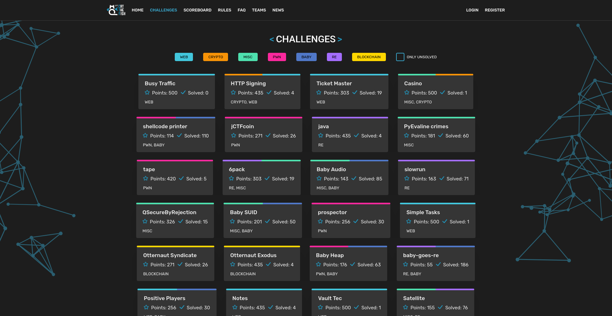
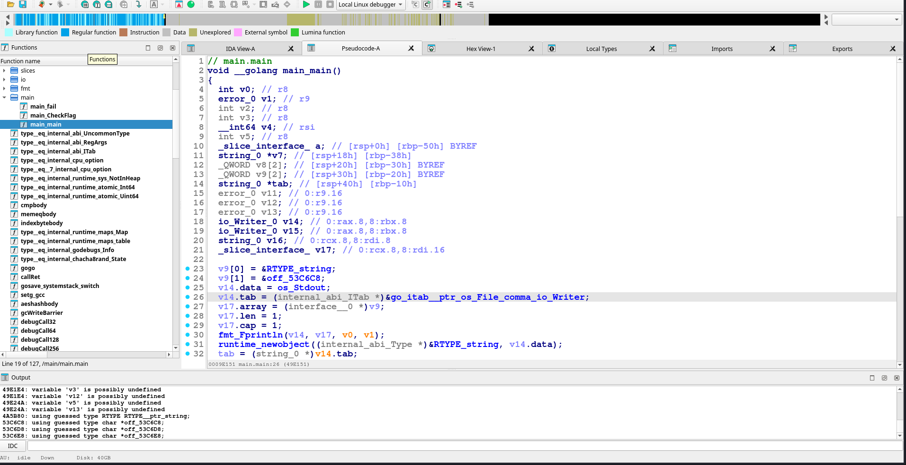

## JustCTF 2025 Writeup

<div style="display:flex;align-items:center;width:100%">
<div style="flex:1;text-align:left">
<a href="OSUGaming2025.html">OSUGaming 2025</a>
</div>
<div style="flex:1;text-align:center">
<a href="index.html">Home</a>
</div>
<div style="flex:1;text-align:right">
<a href="L3akCTF2025.html">L3akCTF 2025</a></div>
</div>

## Challenge Directory

[baby-goes-re](#challenge-name-baby-goes-re)

### Challenge Name: `baby-goes-re`

Before we begin, I just wanted to admire the layout of the JustCTF website - it's really well done and looks super clean! Guess this may be a little biased, since JustCTF 2019 was the first CTF I ever did, and it left a lasting impression on me on a "typical" Jeopardy CTF layout.




Anyway, here's the chall's description:

> do you like golang? Maybe you'll like reving it :) good luck!

I have never done anything seriously with Golang before, and thought this would be a great opportunity to learn more about it. 

After the description, we are given an ELF binary to analyze. Running `file` on it gives:

```baby-goes-re: ELF 64-bit LSB executable, x86-64, version 1 (SYSV), statically linked, BuildID[sha1]=d5a5f939e1de4a13f2ea0bd4a47b8ebc9f9fb998, with debug_info, not stripped```


It was statically linked, which makes its size larger, but as it is not stripped, it does contain debug symbols, which is nice.

Opening it in IDA, we can see the various functions defined in the binary:



I have the Pseudo code view enabled, which makes it a little easier to understand. The `main.main` function is where the program starts executing, and in the function definition, we can see `__golang`, indicating that this is indeed a Golang binary.

We can also see a `main.CheckFlag` and `main.fail` functions clearly defined, which are named nicely thanks to the debug symbols from the binary not being stripped.


<div style="display:flex;align-items:center;width:100%">
<div style="flex:1;text-align:left">
<a href="OSUGaming2025.html">OSUGaming 2025</a>
</div>
<div style="flex:1;text-align:center">
<a href="index.html">Home</a> /
<a href="JustCTF2025.html#">Top</a>
</div>
<div style="flex:1;text-align:right">
<a href="L3akCTF2025.html">L3akCTF 2025</a></div>
</div>
