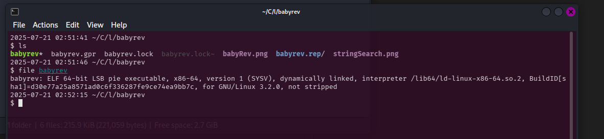
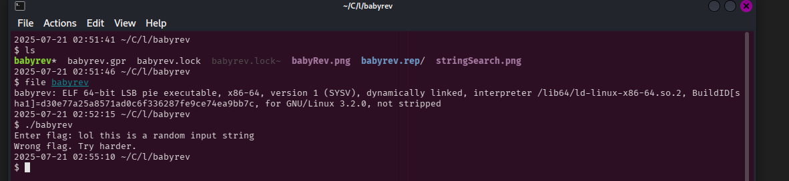
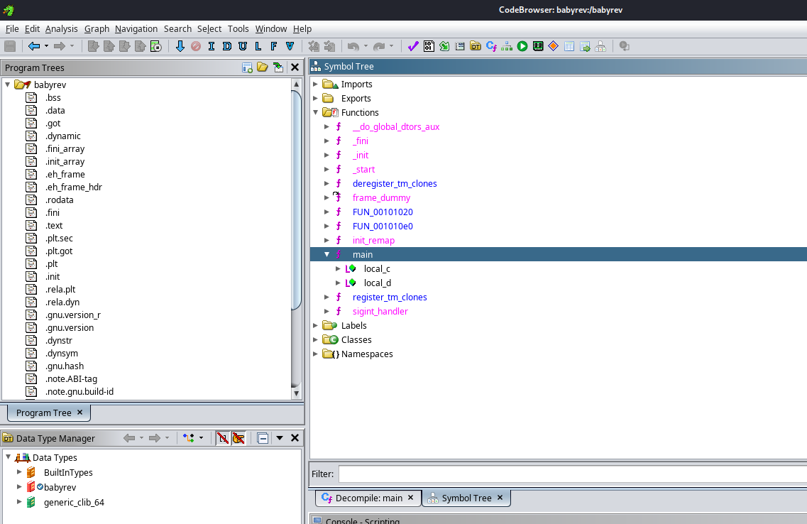
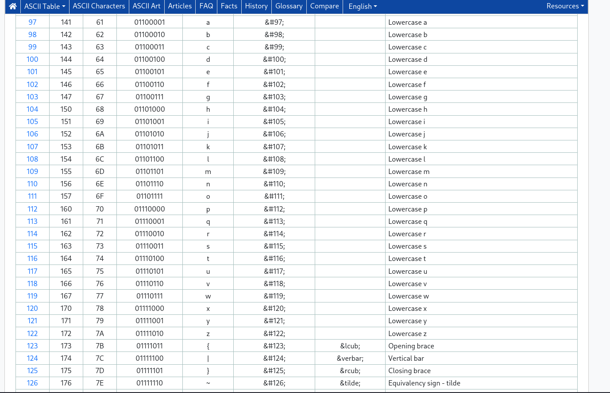
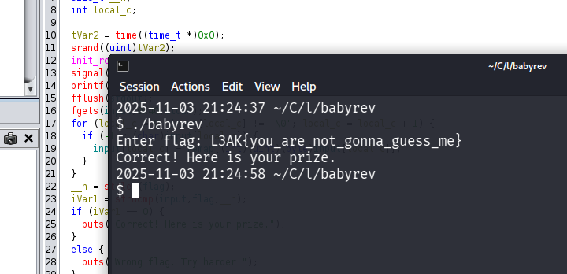

## L3akCTF 2025 Writeup

I wanted to focus on solving Reverse Engineering challenges for this CTF, and here are two that I solved, starting off with the trivial of the bunch, or as they nicely named it, `babyRev`.

### Challenge Name: `babyRev`

Here's the challenge description:

>They always give you strings challenges, we are not the same, we do better.

The instructions did mention that typical rev challenges are strings based, but not this one, I just didn't know that they meant this wouldn't be a "simple" strings challenge.

After looking at the binary, I quickly realized that the challenge was not just about reversing a string, but rather also understanding the underlying logic of the program. A binary called "babyrev" was given, and running the file command revealed that it was a 64-bit ELF executable.



ELF, which stands for Executable and Linkable Format, is a common standard file format for executable files, object code, shared libraries, and core dumps. In a way, you can think of it as a container for the executable code and data that the operating system can run. If you are familiar with EXE files on Windows, ELF files serve a similar purpose on Linux and Unix-like systems.

I then proceeded to run the binary, and it prompted me for a string input asking for the flag:



Naturally, I spun up the binary in Ghidra, a reverse engineering tool that was made by the NSA, and started analyzing the code. I quickly found the main function, which was responsible for handling the input string.

It's fairly short, so here's the decompiled code:

```c
undefined8 main(void)
{
  int iVar1;
  time_t tVar2;
  size_t __n;
  int local_c;
  
  tVar2 = time((time_t *)0x0);
  srand((uint)tVar2);
  init_remap();
  signal(2,sigint_handler);
  printf("Enter flag: ");
  fflush(stdout);
  fgets(input,0x40,stdin);
  for (local_c = 0; input[local_c] != '\0'; local_c = local_c + 1) {
    if (-1 < (char)input[local_c]) {
      input[local_c] = remap[(int)(uint)(byte)input[local_c]];
    }
  }
  __n = strlen(flag);
  iVar1 = strncmp(input,flag,__n);
  if (iVar1 == 0) {
    puts("Correct! Here is your prize.");
  }
  else {
    puts("Wrong flag. Try harder.");
  }
  return 0;
}
```

Here, we see the structure of the binary, and can recognize that the input is checked against a flag variable, which prints `"Correct! Here is your prize."` if the input matches the flag, or `Wrong flag. Try harder.` if it does not.

I found many other functions, but felt that they were not really that useful, other than one other function which I shall show you soon. Either way, here's all the functions that I could see on Ghidra:



The other function that seemed quite peculiar was the one named `init_remap`, which was responsible for initializing a remapping array that would be used to transform the input string before checking it against the flag.

Here's the decompiled code for that function:

```c
void init_remap(void)
{
  int local_c;
  
  for (local_c = 0; local_c < 0x80; local_c = local_c + 1) {
    remap[local_c] = (char)local_c;
  }
  remap[0x61] = 0x71;
  remap[0x62] = 0x77;
  remap[99] = 0x65;
  remap[100] = 0x72;
  remap[0x65] = 0x74;
  remap[0x66] = 0x79;
  remap[0x67] = 0x75;
  remap[0x68] = 0x69;
  remap[0x69] = 0x6f;
  remap[0x6a] = 0x70;
  remap[0x6b] = 0x61;
  remap[0x6c] = 0x73;
  remap[0x6d] = 100;
  remap[0x6e] = 0x66;
  remap[0x6f] = 0x67;
  remap[0x70] = 0x68;
  remap[0x71] = 0x6a;
  remap[0x72] = 0x6b;
  remap[0x73] = 0x6c;
  remap[0x74] = 0x7a;
  remap[0x75] = 0x78;
  remap[0x76] = 99;
  remap[0x77] = 0x76;
  remap[0x78] = 0x62;
  remap[0x79] = 0x6e;
  remap[0x7a] = 0x6d;
  return;
}
```

Hmm how interesting! It seems like the program is remapping certain characters to other characters based on their ASCII values. For example, the character 'a' (ASCII 97) is being remapped to 'q' (ASCII 113), 'b' (ASCII 98) to 'w' (ASCII 119), and so on.

Here's a [chart](https://www.ascii-code.com/) showing the hexadecimal values and their corresponding characters for your viewing pleasure:




And here's the full remapping in a more readable format:


Original char | Remapped char
--------------|----------------
a             | q
b             | w
c             | e
d             | r
e             | t
f             | y
g             | u
h             | i
i             | o
j             | p
k             | a
l             | s
m             | d
n             | f
o             | g
p             | h
q             | j
r             | k
s             | l
t             | z
u             | x
v             | c
w             | v
x             | b
y             | n
z             | m

Searching for strings in Ghidra, I found the flag variable, which was stored as an obfuscated string:


This could be easier with a python script, but at the time I just wanted to quickly get the flag, so I manually remapped each character back to its original form using the remapping table above.

so, the obfuscated flag `L3AK{ngx_qkt_fgz_ugffq_uxtll_dt}` becomes `L3AK{you_are_not_gonna_guess_me}` after reversing the remapping.

running the binary again and inputting the deobfuscated flag gives us:


Well here's the prize!
### Flag: `L3AK{you_are_not_gonna_guess_me}`