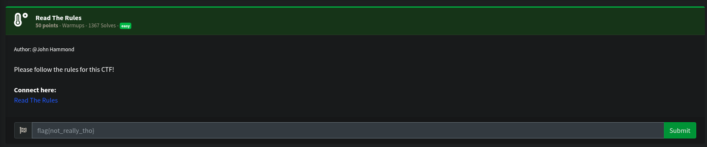
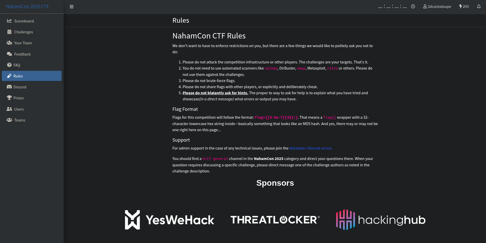
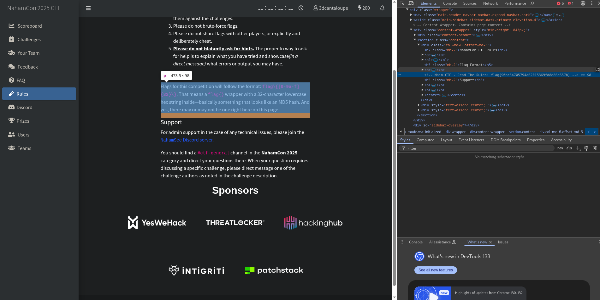
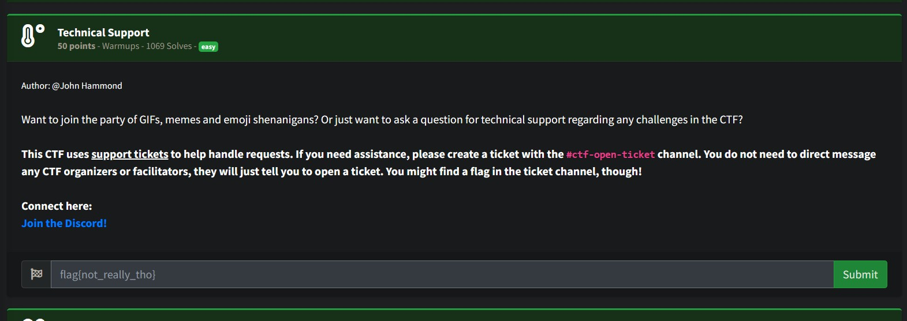
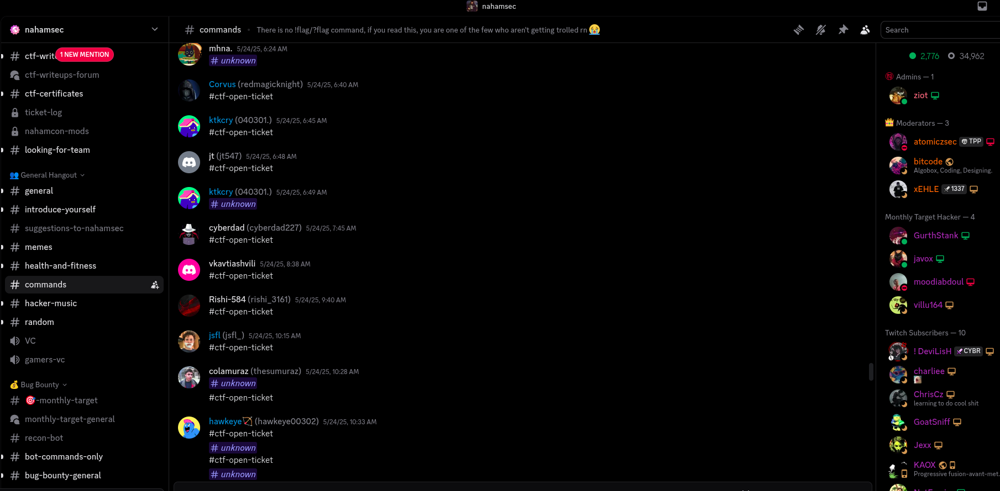
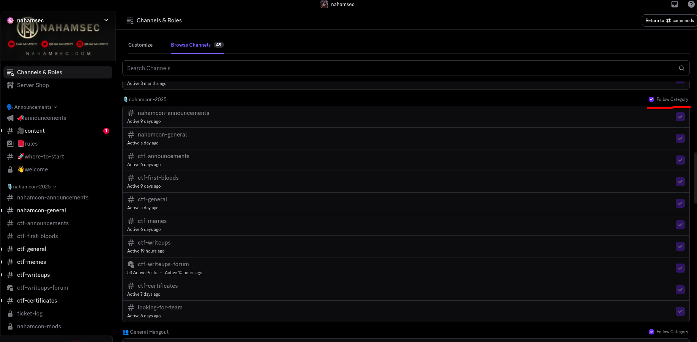
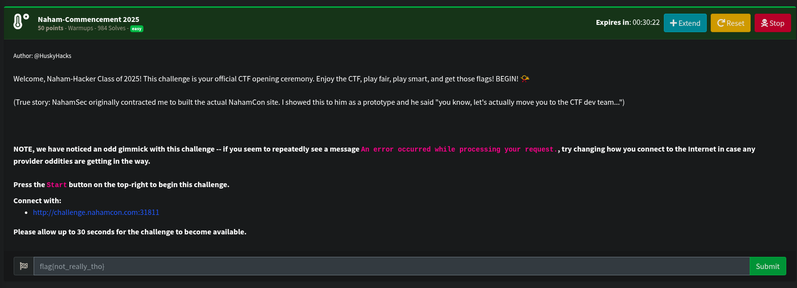
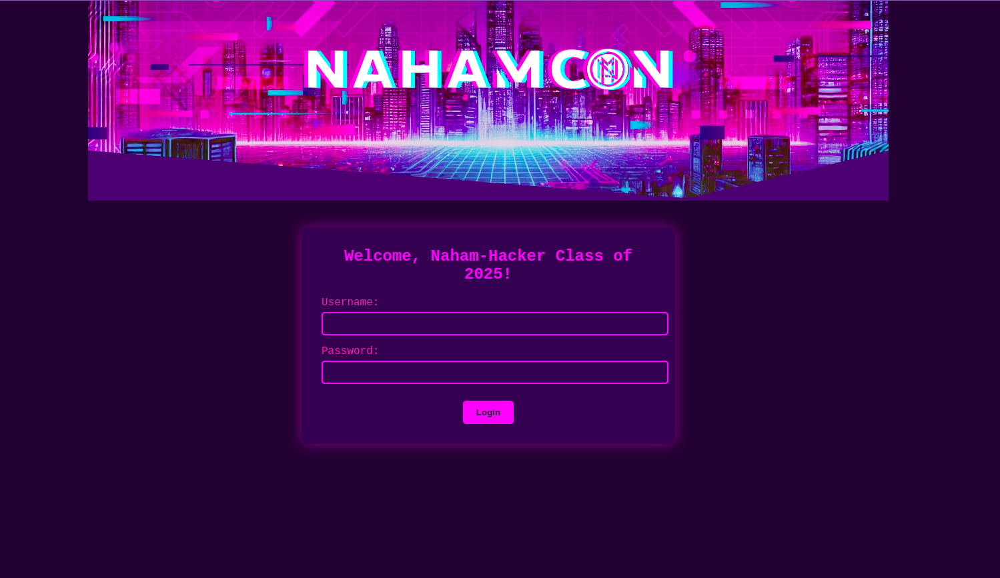
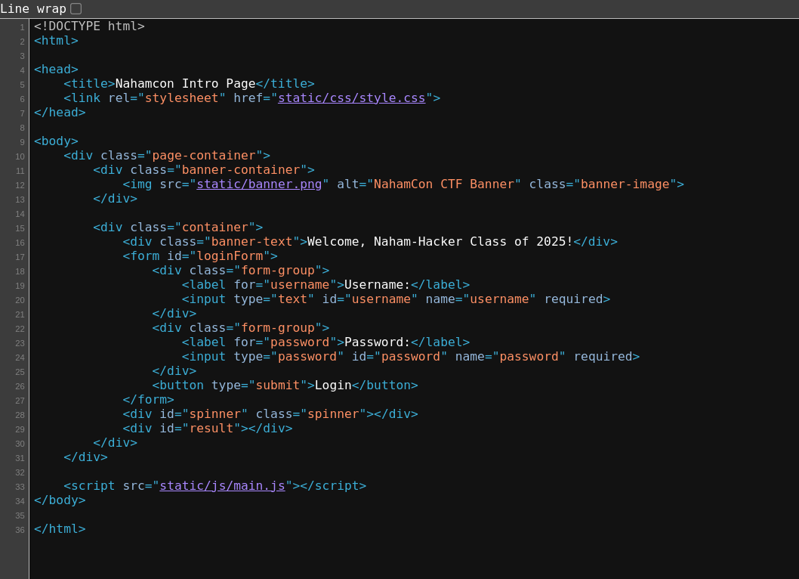
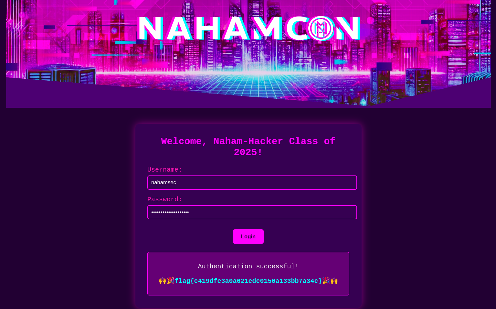

## NahamCon 2025 Writeup

<div style="display:flex;align-items:center;width:100%">
<div style="flex:1;text-align:left">
<a href="SDCTF2025.html">SDCTF 2025</a>
</div>
<div style="flex:1;text-align:center">
<a href="index.html">Home</a>
</div>
<div style="flex:1;text-align:right">
<a href="R3CTF2025.html">R3akCTF 2025</a></div>
</div>

## Challenge Directory

[Read The Rules](#challenge-name-read-the-rules)

[Technical Support](#challenge-name-technical-support)

[Naham-Commencement 2025](#challenge-name-naham-commencement-2025)

[Screenshot](#challenge-name-screenshot)

### Challenge Name: `Read The Rules`

This was quite a simple one, possibly to force us to read the rules of the CTF. The description was as follows:


Clicking on the link led to the [rules](https://ctf.nahamcon.com/rules) page, which had this with no visuble flag (or so you would think at a first glance):



However, when you open the developer tools and inspect the page, you come across the flag, hidden as a comment between the "Flag Format" and "Support" sections:




```
</p>
<!-- Main CTF - Read The Rules: flag{90bc54705794a62015369fd8e86e557b} -->
<h5 class="mb-2">Support</h5>
```

There was not much that I learned from this challenge, but it was a good way to practice reading the source code of a webpage, especially the comments, which can sometimes contain invaluable information.


### Flag: `flag{90bc54705794a62015369fd8e86e557b}`

<div style="display:flex;align-items:center;width:100%">
<div style="flex:1;text-align:left">
<a href="SDCTF2025.html">SDCTF 2025</a>
</div>
<div style="flex:1;text-align:center">
<a href="index.html">Home</a> /
<a href="NahamCon2025.html#">Top</a>
</div>
<div style="flex:1;text-align:right">
<a href="R3CTF2025.html">R3akCTF 2025</a></div>
</div>

<br/><br/>
<br/><br/>

### Challenge Name: `Technical Support`

Yet another simple challenge, this one involved a little bit of discord tomfoolery. The description was as follows:


As I am writing this writeup after the CTF has ended, I can no longer access the specific channel, but I will try my best to explain what I did.

When I first joined the server, I was greeted with all of the general onboarding messages and rules. After going through all of that, I was still not able to find anything related to technical support, tickets or even the ongoing CTF. 

I then just randomly clicked on channels throughout the server, and came across a channel named "commands". Scrolling through this, I found a few mentions of a tickets channel. The flag was in this tickets channel! (In my screenshot, it now says "# unknown" as I no longer have access to that channel)



Clicking on that took me to the tickets channel, and that was where I was able to see that all of the NahamCon related channels were hidden by default. I then had to go into the "Channels & Roles" section to "Follow" the NahamCon2025 category, which then allowed me to see all of the NahamCon 2025 channels.



Fron this, I was able to learn that discord dosen't always show every channel by default, and that you need to follow a category to be able to see all of the channels in it. Even though this was not a technical challenge, it did teach me a little bit about discord and how it works.

### Flag: `Lost to the Sands of Time`

<div style="display:flex;align-items:center;width:100%">
<div style="flex:1;text-align:left">
<a href="SDCTF2025.html">SDCTF 2025</a>
</div>
<div style="flex:1;text-align:center">
<a href="index.html">Home</a> /
<a href="NahamCon2025.html#">Top</a>
</div>
<div style="flex:1;text-align:right">
<a href="R3CTF2025.html">R3akCTF 2025</a></div>
</div>

<br/><br/>
<br/><br/>

### Challenge Name: `Naham-Commencement 2025`

I thought this was going to be one of those sanity check challenges, but it was actually a little bit more than that. Here's the description:


Starting the challenge and going to the link led to a login form:


Taking inspiration from the `Read The Rules` challenge, I decided to view the source code of the page, where I found a reference to a "main.js" file:


here is the actual file if you would like it for yourself: [main.js](NahamCon2025/commencement_main.js)

When looking at the"addEventListner for "DOMContentLoaded" event, which triggers when the HTML document is completely parsed, I noticed four peculiar constants:

```javascript
    const x1 = "dqxqcius";
    const x2 = "YeaTtgUnzezBqiwa2025";
    const x3 = "ZHF4cWNpdXM=";
    const k = "nahamcon";
```

`x1` and `x2` were just random strings, which get used later on in the comparison process. `x3` is just never used, but is a base64 encoded string, which decodes to x1 (`dqxqcius`) for some reason, and `k` is just the string "nahamcon", the name of the CTF.

In addition to this, certain submitted values are also stored as constants.

```javascript
    const f = document.getElementById('loginForm');
    const u = document.getElementById('username');
    const p = document.getElementById('password');
    const s = document.getElementById('spinner');
    const d = document.getElementById('result');
```

In the addEventListener for the "submit" event, a constant `q1` is set by calling the function `a`, which modifies the username value. Another constant `w1` is set by calling the function `b`, which modifies the password value, passing in k as a parameter. These constants are then used to compare against the values of `x1` and `x2` respectively.

```javascript
    const q = u.value;
    const w = p.value;


    const q1 = a(q);
    const w1 = b(w, k);

    if (q1 !== x1 || w1 !== x2) {
        d.textContent = "Access denied. Client-side validation failed. Try again.";
        d.className = "error";
        d.style.display = "block";
        return;
    }
```

Here's function `a`:

```javascript
function a(t) {
    let r = '';
    for (let i = 0; i < t.length; i++) {
        const c = t[i];
        if (/[a-zA-Z]/.test(c)) {
            const d = c.charCodeAt(0);
            const o = (d >= 97) ? 97 : 65;
            const x = (d - o + 16) % 26 + o;
            r += String.fromCharCode(x);
        } else {
            r += c;
        }
    }
    return r;
}
```

And here's function `b`:

```javascript
function b(t, k) {
    let r = '';
    let j = 0;
    for (let i = 0; i < t.length; i++) {
        const c = t[i];
        if (/[a-zA-Z]/.test(c)) {
            const u = c === c.toUpperCase();
            const l = c.toLowerCase();
            const d = l.charCodeAt(0) - 97;
            const m = k[j % k.length].toLowerCase();
            const n = m.charCodeAt(0) - 97;
            const e = (d + n) % 26;
            let f = String.fromCharCode(e + 97);
            if (u) {
                f = f.toUpperCase();
            }
            r += f;
            j++;
        } else {
            r += c;
        }
    }
    return r;
}
```
The function `a` shifts each letter in the username by 16 positions in the alphabet, wrapping around if necessary. The function `b` shifts each letter in the password based on the corresponding letter in the string "nahamcon", wrapping around if necessary.

To solve this challenge, I essentially had to reverse the transformations applied by these functions, which involved shifting the letters back by 16 positions for the username and shifting them back based on the corresponding letter in "nahamcon" for the password. This can be done quite trivially by subtracting instead of adding and vice versa, making sure to add 26 if the result is negative to wrap around the alphabet.

Here's the modified line for function `a`:

```javascript
    const x = (d - o - 16 + 26) % 26 + o;
```

And for function `b`:

```javascript
    const e = (d - n + 26) % 26;
```

After making these changes, I was able to call these functuons with these inputs:

```javascript
a("dqxqcius")
b("YeaTtgUnzezBqiwa2025", "nahamcon")
```

From which I got the username `nahamsec` and the password `LetTheGamesBegin2025`.

I then entered these into the login form, and was greeted with a success message and the flag:


### Flag: `flag{c419dfe3a0a621edc0150a133bb7a34c}`

<div style="display:flex;align-items:center;width:100%">
<div style="flex:1;text-align:left">
<a href="SDCTF2025.html">SDCTF 2025</a>
</div>
<div style="flex:1;text-align:center">
<a href="index.html">Home</a> /
<a href="NahamCon2025.html#">Top</a>
</div>
<div style="flex:1;text-align:right">
<a href="R3CTF2025.html">R3akCTF 2025</a></div>
</div>

<br/><br/>
<br/><br/>

### Challenge Name: `Screenshot`
