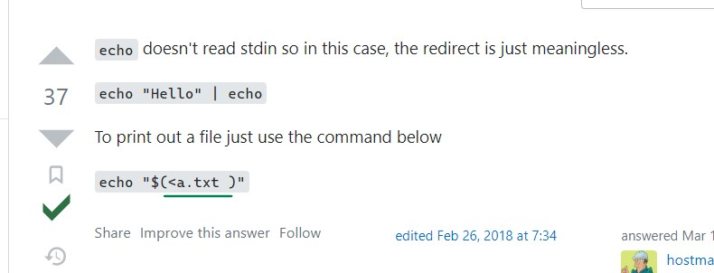
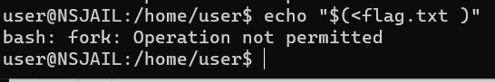
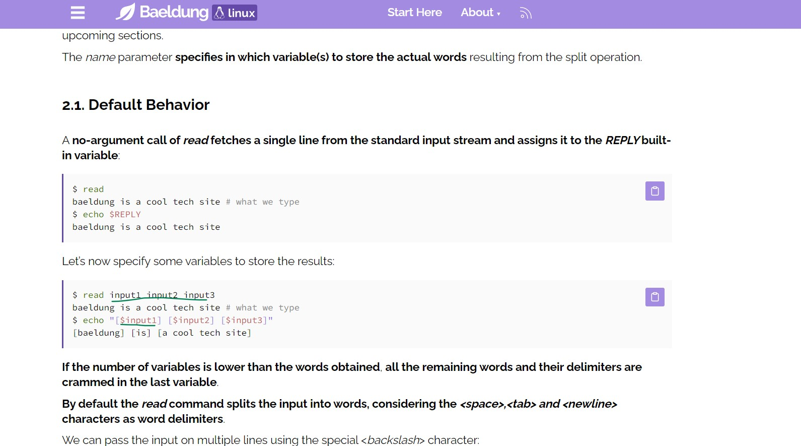
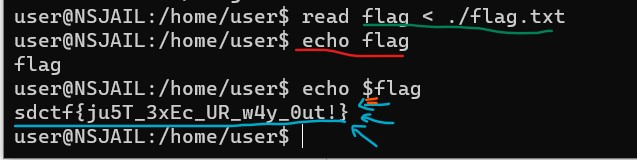

## SDCTF2023 Writeup

### Challenge Name: `Fork bomb protector`

Here is the challenge on the website 🕷🕸:


After reading the description, and as I did hear about fork bombs from a youtube video before, I sort of knew what they were aiming to do here.

Anyway, I then decided to check out what was in nofork.py 🙈🍴:
```
#! /usr/bin/env python3
import os
from seccomp import SyscallFilter, ALLOW, ERRNO
from errno import EPERM

FORBID = ERRNO(EPERM)

# Ban all fork-related syscalls to prevent fork bombs
def init_seccomp():
    f = SyscallFilter(defaction=ALLOW)

    f.add_rule(FORBID, "fork")
    f.add_rule(FORBID, "vfork")
    f.add_rule(FORBID, "clone")

    f.load()

init_seccomp()
os.execvp('bash', ['bash'])
```
I found that forking or cloning was not allowed. In hindsight, I wish I had researched what this was, and not just moved on to the next thing 😅

Anyway, using the terminal, I was able to log onto the remote machiene to begin the challenge 📺🖱


In order to get a view of what the hell is on the directory that I was looking at, I decided to run an ls totally expecting it to work perfectly fine 🤡🤡🤡 except it didn't 😭😭😭


I did not know that ls could be considered forking. Later I learned that it was because ls was a bash command, and bash was not allowed to be forked, as it just creates a new process for ls.


Ran pwd to see where I was, and it actually worked!!! 🤩🤩🤩 I was able to see that I was in the /home/user directory, which I already knew 🌵🍂


To see if the echo command works, and oh god it did!! 😲🙀🙀 I then tried to use a "*" to see if it actually prints the contents of the directory


It did!! 🎅🤶👼


I then tried to use the cat command 🐈😺🙀 to print out the contents of the flag.txt file, but it didn't work 😿😢😭

### `https://stackoverflow.com/questions/22377792/how-to-use-echo-command-to-print-out-content-of-a-text-file`
[StackOverflow post](https://stackoverflow.com/questions/22377792/how-to-use-echo-command-to-print-out-content-of-a-text-file)

I then decided to research ways to get the contents of the file, and found this epix StackOverFlow post 😎🆒


I then tried to use the command the comment described. 🧪🥼🧪


It did not wrk. 🦙🎠



A differnt iteration maybe? 🤔💭🤔



Or maybe not. Maybe I should just give up. Maybe I should put aside my dream of being an epix hackerFellow 😴😐😶

### `https://www.baeldung.com/linux/read-command`
[Read command](https://www.baeldung.com/linux/read-command)

I then decided to go into the deapths of my brain, (and duckDuckGo obv) trying to figure out differnt ways to read the contents of the flag.txt file, coming about this post 🤓🤓🤓



I then tried to use the command the post described, modifying it to fit my needs 🤖🤖🤖

The final commands I ended up with were :
```read flag < ./flag.txt
echo $flag
``` 



With some mistakes along the way (like forgetting to add the "$" before flag when echoing the variable), I was able to finally get the flag!! 🎉🎉🎉

### Flag: `sdctf{ju5T_3xEc_UR_w4y_0ut!}`

I was unsure what the flag meant, but I was happy to have gotten it 😊😊😊

In case you wanna know it so badly, here you go lol 😂😂😂:
[EXE](https://www.geeksforgeeks.org/exec-command-in-linux-with-examples/)

Well that's about it for today! Thanks for reading my first ever CTF Writeup (Even though the formatting is so bad)!!! 🐣🦃🍗


