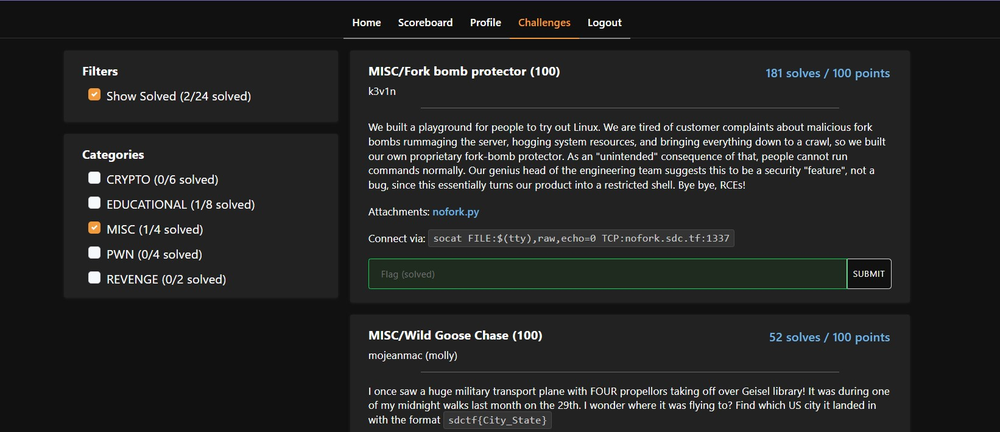
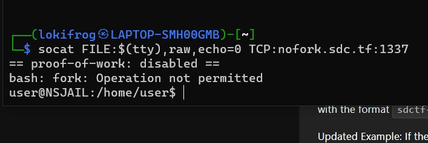
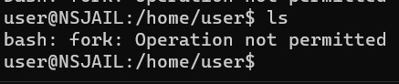
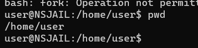
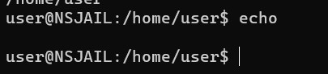
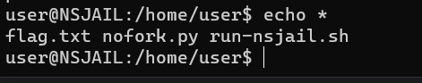
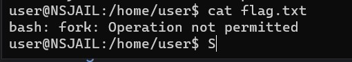
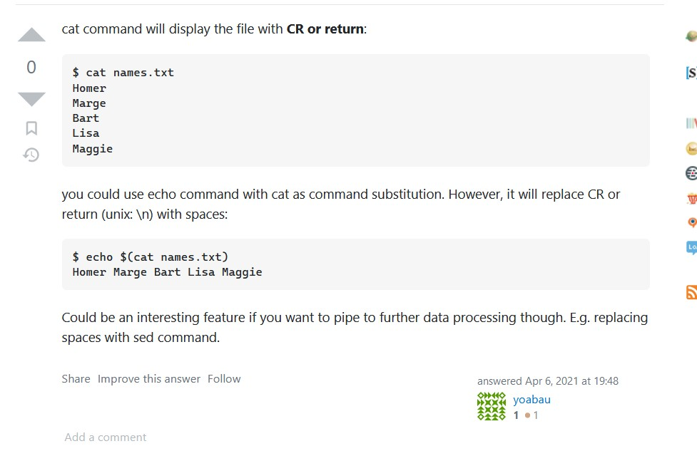
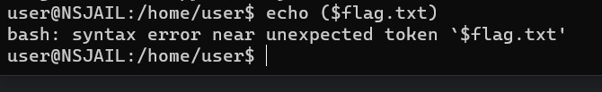

## SDCTF2023 Writeup

### Challenge Name: `Fork bomb protector`

Here is the challenge on the website 🕷🕸:


After reading the description, and as I did hear about fork bombs from a youtube video before, I sort of knew what they were aiming to do here.

Anyway, I then decided to check out what was in nofork.py 🙈🍴:
```
#! /usr/bin/env python3
import os
from seccomp import SyscallFilter, ALLOW, ERRNO
from errno import EPERM

FORBID = ERRNO(EPERM)

# Ban all fork-related syscalls to prevent fork bombs
def init_seccomp():
    f = SyscallFilter(defaction=ALLOW)

    f.add_rule(FORBID, "fork")
    f.add_rule(FORBID, "vfork")
    f.add_rule(FORBID, "clone")

    f.load()

init_seccomp()
os.execvp('bash', ['bash'])
```
I found that forking or cloning was not allowed. In hindsight, I wish I had researched what this was, and not just moved on to the next thing 😅

Anyway, using the terminal, I was able to log onto the remote machiene to begin the challenge 📺🖱


In order to get a view of what the hell is on the directory that I was looking at, I decided to run an ls totally expecting it to work perfectly fine 🤡🤡🤡 except it didn't 😭😭😭

I did not know that ls could be considered forking. Later I learned that it was because ls was a bash command, and bash was not allowed to be forked, as it just creates a new process for ls.


Ran pwd to see where I was, and it actually worked!!! 🤩🤩🤩 I was able to see that I was in the /home/user directory, which I already knew 🌵🍂


To see if the echo command works, and oh god it did!! 😲🙀🙀 I then tried to use a "*" to see if it actually prints the contents of the directory

It did!! 🎅🤶👼


I then tried to use the cat command to print out the contents of the flag.txt file, but it didn't work 😿😢😭

### `https://stackoverflow.com/questions/22377792/how-to-use-echo-command-to-print-out-content-of-a-text-file`

I then decided to research ways to get the contents of the file, and found this epix stackOverFlow post. I then tried to use the command the comment described.

It did not wrk. 🦙🎠


https://stackoverflow.com/questions/22377792/how-to-use-echo-command-to-print-out-content-of-a-text-file

https://www.baeldung.com/linux/read-command