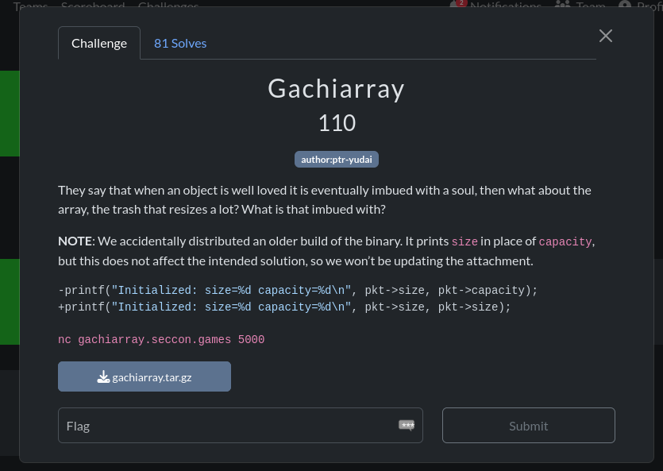
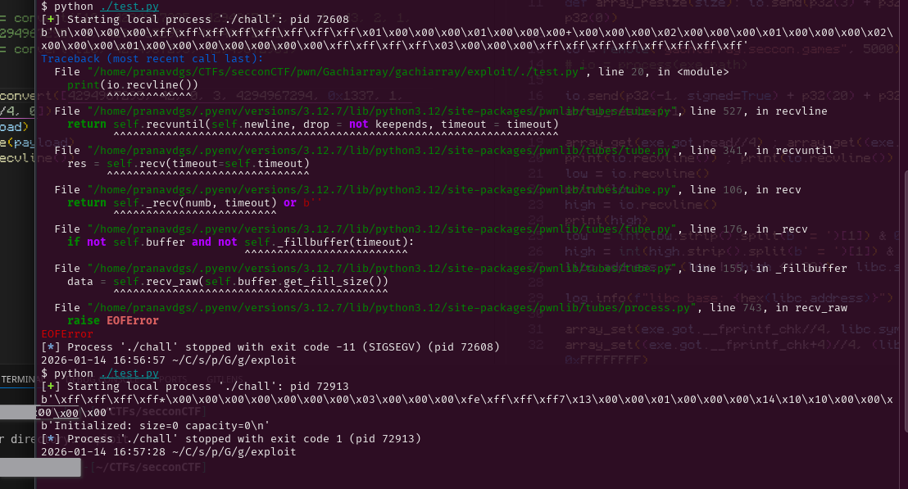
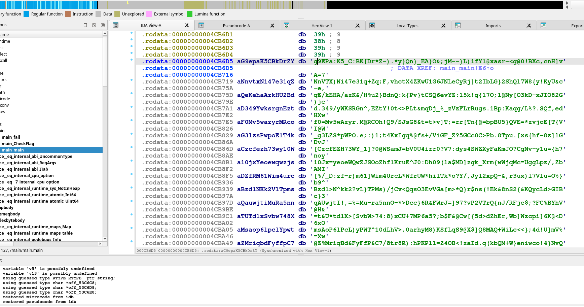
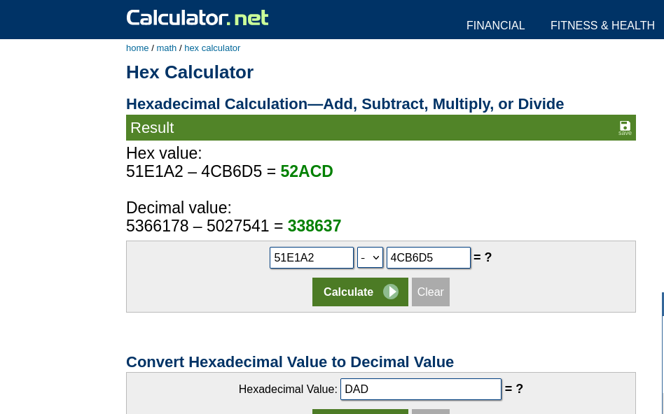
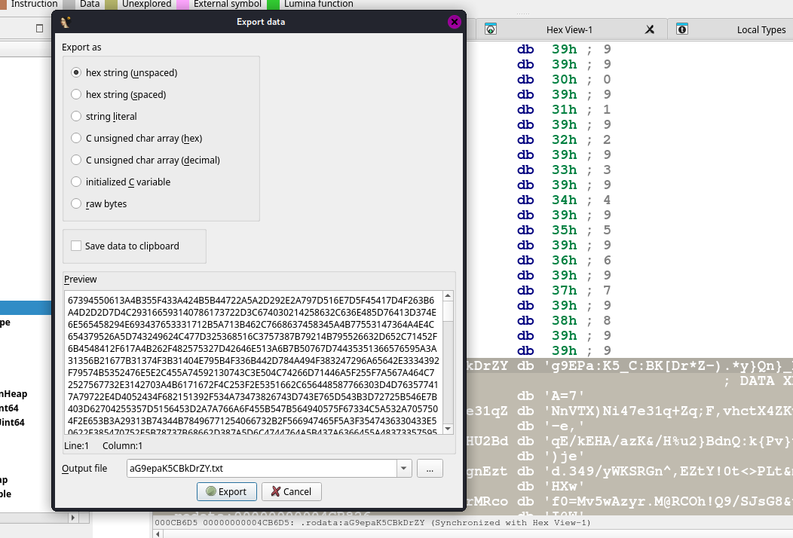
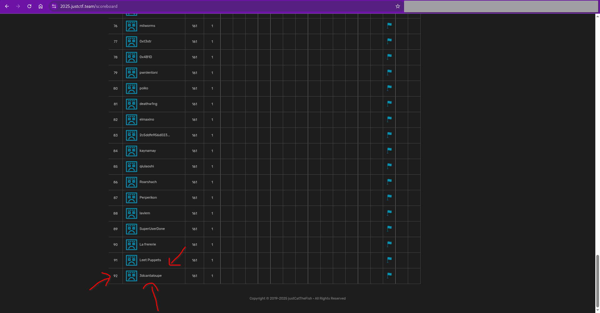

## Seccon 14 (2025) Writeup

<div style="display:flex;align-items:center;width:100%">
<div style="flex:1;text-align:left">
<a href="https://pointerpointer.com/">WoawoWOaw</a>
</div>
<div style="flex:1;text-align:center">
<a href="index.html">Home</a>
</div>
<div style="flex:1;text-align:right">
<a href="OSUGaming2025.html">OSU Gaming 2025</a></div>
</div>

## Challenge Directory

[Gachiarray](#challenge-name-gachiarray)


### Challenge Name: `Gachiarray`


A Japanese CTF! Interesting! That gives me a little hint for how I can find out what the name of the challenge really means.

A quick google search of "Gachi" gives me the meaning being "serious" in Japanese slang. So maybe this challenge is about taking arrays seriously? Hmmmmm.

> The Japanese phrase 'ガチ' (gachi) is an abbreviation of the word 'ガチンコ' (gachinko), which means "serious" or "intense." It is commonly used in informal conversations, particularly among younger generations. 'ガチ' can be used as an adjective or an adverb to describe a situation, person, or activity that is genuinely serious, competitive, or authentic.

> Here are a few examples to illustrate the usage of 'ガチ':

> 1. ゲームでガチ勝負しよう！
(Gēmu de gachi shōbu shiyō!)
Let's have a serious match in the game!

> In this example, 'ガチ' is used to emphasize the intensity and competitiveness of the game. It suggests that the players will give their best effort and take the game seriously.

<small>source: [hinative.com/questions/24229693](https://hinative.com/questions/24229693)</small>

Aaaany way, a pwn challenge! How fun yet again!!!! jkjk, I shall be "Gachi" about this challenge from now on.

> They say that when an object is well loved it is eventually imbued with a soul, then what about the array, the trash that resizes a lot? What is that imbued with?

And the Note they grace us with:

> NOTE: We accidentally distributed an older build of the binary. It prints size in place of capacity, but this does not affect the intended solution, so we won’t be updating the attachment.

```c
-printf("Initialized: size=%d capacity=%d\n", pkt->size, pkt->capacity);
+printf("Initialized: size=%d capacity=%d\n", pkt->size, pkt->size);
```

> Author: [`ptr-yudai`](https://github.com/ptr-yudai)

here it is in a screenshot I took some time ago:


Like a rev challenge, we are given a binary, but unlike a typical rev challenge, some docker related files and the SOURCE CODE as well!!!! Wooohooo!!!! (or so one would think at first glance...)

Running `file` on the binary gives:

```bash
chall: ELF 64-bit LSB executable, x86-64, version 1 (SYSV),
dynamically linked, interpreter /lib64/ld-linux-x86-64.so.2,
BuildID[sha1]=8c6fb704ae22fe48765f79aecff4efecc0e88d55, for GNU/
Linux 3.2.0, not stripped
```

Unfortunately, it doesn't really matter that the binary is both dynamically linked and not stripped, since we have the source code anyway. Oh well :/

I keep talking about juicy c code, but where is it you may ask?

...

here you gooooooo:

```c
// main.c
#include <assert.h>
#include <stdio.h>
#include <stdlib.h>
#include <stdint.h>
#include <string.h>
#include <unistd.h>

typedef union {
  struct {
    int32_t capacity;
    int32_t size;
    int32_t initial;
  };
  struct {
    int32_t op;
    int32_t index;
    int32_t value;
  };
} pkt_t;

struct {
  uint32_t size;
  uint32_t capacity;
  int32_t initial;
  int32_t *data;
} g_array;

void fatal(const char *msg) {
  fprintf(stderr, "[ERROR] %s\n", msg);
  exit(1);
}

void read_packet(pkt_t *pkt) {
  if (read(0, pkt, sizeof(pkt_t)) != sizeof(pkt_t))
    fatal("Truncated input");
}

void array_init(pkt_t *pkt) {
  if (pkt->size > pkt->capacity)
    pkt->size = pkt->capacity;

  g_array.data = (int*)malloc(pkt->capacity * sizeof(int));
  if (!g_array.data)
    *(uint64_t*)pkt = 0;

  g_array.size = pkt->size;
  g_array.capacity = pkt->capacity;
  g_array.initial = pkt->initial;

  for (size_t i = 0; i < pkt->size; i++)
    g_array.data[i] = pkt->initial;

  printf("Initialized: size=%d capacity=%d\n",
   pkt->size, pkt->capacity);
}
... the main method will be discussed later ...
```

So we have a simple program that implements a dynamic array with 3 operations: get, set, and resize. Before we can use these operations, we need to initialize the array with a size, capacity, and initial value with the first "packet" we send. 

```c
// pkt_t packet structure
typedef union {
  struct {
    int32_t capacity;
    int32_t size;
    int32_t initial;
  };
  struct {
    int32_t op;
    int32_t index;
    int32_t value;
  };
} pkt_t;
```

What's interesting is the struct of the `pkt_t` being a union, indicating that the same packet structure is used for both the initialization and the operations. (Which is determined by the first packet sent vs the rest of the packets sent after that).

Here's how that looks in the main method, where we have a `array_init(&pkt);` call right after reading the first packet:

```c
// main.c (continued) [main method]
void main() {
  pkt_t pkt;
  setbuf(stdin, NULL);
  setbuf(stdout, NULL);
  setbuf(stderr, NULL);

  read_packet(&pkt);
  array_init(&pkt);

  while (1) {
    read_packet(&pkt);
    switch (pkt.op) {
      case 1: // get
        if (g_array.size <= pkt.index)
          fatal("Out-of-bounds");
        printf("array[%d] = %d\n", pkt.index, 
        g_array.data[pkt.index]);
        break;

      case 2: // set
        if (g_array.size <= pkt.index)
          fatal("Out-of-bounds");
        g_array.data[pkt.index] = pkt.value;
        printf("array[%d] = %d\n", pkt.index, pkt.value);
        break;

      case 3: // resize
        if (g_array.capacity < pkt.size)
          fatal("Over capacity");
        for (int i = g_array.size; i < pkt.size; i++)
          g_array.data[i] = g_array.initial;
        g_array.size = pkt.size;
        printf("New size set to %d\n", pkt.size);
        break;

      default:
        exit(0);
    }
  }
}
```

It is quite peculiar how the size and capacity in `g_array` (the backend array structure we are working with) are both `uint32_t`, meaning they are unsigned integers, but in the `pkt_t` structure, they are `int32_t`, aka signed integers. I thought this might be a little fishy if you haven't caught on already!

```c
// g_array structure
struct {
  uint32_t size;
  uint32_t capacity;
  int32_t initial;
  int32_t *data;
} g_array;
```


Now we can go onto running the application and I did this by just smashing my keyboard with random inputs to see how it behaves.

```bash
./chall
65787987875645768798
Initialized: size=926431543 capacity=926431543
[ERROR] Truncated input
```

We can see what's in the note in action here, where the size and capacity that are printed out are the same, even though in our input, they were different values. The `fatal()` and `read_packet()` functions are as follows are also accounted for, with the packet [input] failing the checks in `read_packet()` resulting in a call to `fatal()`.

Here are both the functions for your reference:

```c
// fatal and read_packet functions
void fatal(const char *msg) {
  fprintf(stderr, "[ERROR] %s\n", msg);
  exit(1);
}

void read_packet(pkt_t *pkt) {
  if (read(0, pkt, sizeof(pkt_t)) != sizeof(pkt_t))
    fatal("Truncated input");
}
```

As I have very little experience with pwntools, I decided to try it out with some simple inputs, testing out the get, set, and resize operations.

```python
from pwn import *
io = process('./chall')

def convert(data):
    pay = b''
    for c in data:
        pay += p32(c)
    return pay

# payload 1
payload = p32(1) + p32(1) + p32(32) + p32(202) + p32(2) + p32(0) + p32(4294967295)

# payload 2
payload = convert([10, 4294967295, 4294967295, 1, 1, 43, 2, 1, 2, 1, 0, 4294967295, 3, 4294967295, 4294967295])

# payload 3
payload = convert([10, 4294967295, 4294967295])

# payload 4
payload = convert([4294967295, 42, 0, 3, 4294967294, 0x1337, 1, 0x0404050//4, 0])

print(payload)
io.sendline(payload)
print(io.recvline())
```

To explain some basic pwntools here, `p32()` is used to pack a 32-bit integer into its byte representation in little-endian format. 

The `convert()` function takes a list of integers and converts each integer into its packed byte representation using `p32()`, then concatenates them into a single byte string.

Here's the output of payload 2 and 4:




As you can see, I messed around with negative numbers (like `-1` being `4294967295` in unsigned 32 bit representation) to see how the program would react. In Payload 4's output for instance, we can see that both the size and capacity being printed out are 0, even though the input for the capacity was `-1` / `4294967295` in unsigned representation.

To help explain this, we need to look deeper into the `array_init()` function:

```c
// array_init function
void array_init(pkt_t *pkt) {
  if (pkt->size > pkt->capacity)
    pkt->size = pkt->capacity;

  g_array.data = (int*)malloc(pkt->capacity * sizeof(int));
  if (!g_array.data) // if malloc fails
    *(uint64_t*)pkt = 0;

  g_array.size = pkt->size; // uint32_t = int32_t
  g_array.capacity = pkt->capacity; // uint32_t = int32_t
  g_array.initial = pkt->initial; // int32_t = int32_t

  for (size_t i = 0; i < pkt->size; i++)
    g_array.data[i] = pkt->initial;

  printf("Initialized: size=%d capacity=%d\n",
   pkt->size, pkt->capacity);
}
```

Suppose, like in Payload 4, we send the following query to initialize the array:

```c
capacity: 4294967295 (0xFFFFFFFF, -1 in signed 32-bit)
size: 42
initial: 0
```

Since `pkt->size` (42) is indeed greater than `pkt->capacity` (-1), the condition in the first `if` statement is true, and thus `pkt->size` is set to `pkt->capacity`, which is -1.

Then, when we assign `g_array.size = pkt->size;`, we are effectively assigning -1 (from `pkt->size`) to an unsigned integer (`g_array.size`). In C, when a negative signed integer is assigned to an unsigned integer, it wraps around to a very large positive value. Specifically, -1 becomes 4294967295 when interpreted as an unsigned 32-bit integer.


<small>Here's a fun example of an odometer rolling over, which is quite similar to how integer overflow works!</small>

This is known as integer overflow, and it can lead to unexpected behavior (as we shall see!) if not handled carefully. You can learn more about it on this [Wikipedia article](https://en.wikipedia.org/wiki/Integer_overflow).

When the program tries to allocate memory with `malloc(pkt->capacity * sizeof(int));`, it is essentially trying to allocate a massive amount of memory (as -1 is interpreted as 4294967295 and 4294967295 * 4 bytes = 17179869180 bytes, or about 16 GiB). This is likely to fail on most systems due to insufficient memory.

You would think that this is fine, as the next line to catch a failed malloc ` *(uint64_t*)pkt = 0;` would set the first 8 bytes of `pkt` to 0, effectively setting both `capacity` and `size` to 0.

**you** (*probably*): So wer good right? 

**me**: ...

**you** (*probably*): Wait, what? we should be good right? Wouldn't the backend g_array just not get allocated as the capacity and size are both 0 now?


Well, theoretically yes, but in practice, no. 

Let's look at what the compiler "optimizes" the `array_init()` function to by analyzing the binary's disassembly [the variables of which I have graciously annotated for you :) ]:

```c
// Binary Ninja decompilation of array_init function
+0x13e0    int64_t array_init(int32_t* pkt) {

+0x13e0        int32_t pkt->capacity = *(uint32_t*)pkt;
+0x13e0        // pkt[1] is pkt->size
+0x13f2        if (pkt[1] > pkt->capacity)
+0x13f4            pkt[1] = pkt->capacity;
+0x13f4        
+0x13fe        int32_t (* g_array.data)[0x4] =
+0x13fe            malloc((int64_t)pkt->capacity << 2);
+0x1403        data_404080 = g_array.data;
+0x1403        
+0x1410        if (!g_array.data)
+0x14e7            *(uint64_t*)pkt = 0;
+0x14e7        
+0x1416        int64_t g_array.size = (int64_t)pkt[1];
+0x141a        int32_t g_array.initial = pkt[2];
+0x1425        data_404078 = g_array.initial;
+0x142b        int32_t garray.size =
+0x142b            (uint32_t)g_array.size;
+0x142e        int32_t zmm0[0x4] = _mm_unpacklo_epi32(
+0x142e            (uint128_t)(uint32_t)g_array.size, 
+0x142e            (uint64_t)pkt->capacity);
+0x142e        // capacity value from the stored
+0x142e        // variable [+0x13e0] used instead of
+0x142e        // int32_t* pkt!!!!
+0x1432        g_array = *(uint64_t*)&zmm0[0];

            //...loop to initialize the array ommited

+0x14dc        return __printf_chk(2, 
+0x14dc            "Initialized: size=%d capacity=%d\n", 
+0x14dc            (uint64_t)garray.size, 
+0x14dc            (uint64_t)garray.size, zmm0);
+0x13e0    }
```

Feel free to read more about this specific compiler quirk in this github gist: [What is the Strict Aliasing Rule and Why do we care?](https://gist.github.com/shafik/848ae25ee209f698763cffee272a58f8)


Well after that


<div style="display:flex;align-items:center;width:100%">
<div style="flex:1;text-align:left">
<p>XXXXXXXXXXXXXXXXXXXXXXXXXXXXXX</p>
</div>
<div style="flex:1;text-align:center">
<p>In Construction</p>
</div>
<div style="flex:1;text-align:right">
<p>XXXXXXXXXXXXXXXXXXXXXXXXXXXXXX</p></div>
</div>
<div style="display:flex;align-items:center;width:100%">
<div style="flex:1;text-align:left">
<p>XXXXXXXXXXXXXXXXXXXXXXXXXXXXXX</p>
</div>
<div style="flex:1;text-align:center">
<p>In Construction</p>
</div>
<div style="flex:1;text-align:right">
<p>XXXXXXXXXXXXXXXXXXXXXXXXXXXXXX</p></div>
</div>
<div style="display:flex;align-items:center;width:100%">
<div style="flex:1;text-align:left">
<p>XXXXXXXXXXXXXXXXXXXXXXXXXXXXXX</p>
</div>
<div style="flex:1;text-align:center">
<p>In Construction</p>
</div>
<div style="flex:1;text-align:right">
<p>XXXXXXXXXXXXXXXXXXXXXXXXXXXXXX</p></div>
</div>


<br/><br/>
<br/><br/>


<div style="display:flex;align-items:center;width:100%">
<div style="flex:1;text-align:left">
<a href="https://pointerpointer.com/">WoawoWOaw</a>
</div>
<div style="flex:1;text-align:center">
<a href="index.html">Home</a> /
<a href="Seccon142025.html#">Top</a>
</div>
<div style="flex:1;text-align:right">
<a href="OSUGaming2025.html">OSU Gaming 2025</a></div>
</div>


<!-- 
Before we begin, I just wanted to admire the layout of the JustCTF website - it's really well done and looks super clean! Guess this may be a little biased, since JustCTF 2019 was the first CTF I ever did, and it left a lasting impression on me for a "typical" Jeopardy CTF layout.


Anyway, here's the chall's description:

> do you like golang? Maybe you'll like reving it :) good luck!

I have never done anything seriously with Golang before, and thought this would be a great opportunity to learn more about it. 

After the description, we are given an ELF binary to analyze. Running `file` on it gives:

```baby-goes-re: ELF 64-bit LSB executable, x86-64, version 1 (SYSV), statically linked, BuildID[sha1]=d5a5f939e1de4a13f2ea0bd4a47b8ebc9f9fb998, with debug_info, not stripped```


It was statically linked, which makes its size larger, but as it is not stripped, it does contain debug symbols, which is nice.

Opening it in IDA, we can see the various functions defined in the binary:


I have the Pseudo code view enabled, which makes it a little easier to understand. The `main.main` function is where the program starts executing, and in the function definition, we can see `__golang`, indicating that this is indeed a Golang binary.

We can also see a `main.CheckFlag` and `main.fail` functions clearly defined, which are named nicely thanks to the debug symbols from the binary not being stripped.


Since they are fairly small functions, I'll have the actual decompilation here:


```c
// main.main
void __golang main_main()
{
  int v0; // r8
  error_0 v1; // r9
  int v2; // r8
  int v3; // r8
  __int64 v4; // rsi
  int v5; // r8
  _slice_interface_ a; // [rsp+0h] [rbp-50h] BYREF
  string_0 *v7; // [rsp+18h] [rbp-38h]
  _QWORD v8[2]; // [rsp+20h] [rbp-30h] BYREF
  _QWORD v9[2]; // [rsp+30h] [rbp-20h] BYREF
  string_0 *tab; // [rsp+40h] [rbp-10h]
  error_0 v11; // 0:r9.16
  error_0 v12; // 0:r9.16
  error_0 v13; // 0:r9.16
  io_Writer_0 v14; // 0:rax.8,8:rbx.8
  io_Writer_0 v15; // 0:rax.8,8:rbx.8
  string_0 v16; // 0:rcx.8,8:rdi.8
  _slice_interface_ v17; // 0:rcx.8,8:rdi.16

  v9[0] = &RTYPE_string;
  v9[1] = &off_53C6C8;
  v14.data = os_Stdout;
  v14.tab = (internal_abi_ITab *)&go_itab__ptr_os_File_comma_io_Writer;
  v17.array = (interface__0 *)v9;
  v17.len = 1;
  v17.cap = 1;
  fmt_Fprintln(v14, v17, v0, v1);
  runtime_newobject((internal_abi_Type *)&RTYPE_string, v14.data);
  tab = (string_0 *)v14.tab;
  v8[0] = &RTYPE_string;
  v8[1] = &off_53C6D8;
  v14.data = os_Stdout;
  v14.tab = (internal_abi_ITab *)&go_itab__ptr_os_File_comma_io_Writer;
  v17.array = (interface__0 *)v8;
  v17.len = 1;
  v17.cap = 1;
  fmt_Fprint(v14, v17, v2, v11);
  a.cap = (int)&RTYPE__ptr_string;
  v7 = tab;
  v14.data = os_Stdin;
  v14.tab = (internal_abi_ITab *)&go_itab__ptr_os_File_comma_io_Reader;
  v17.array = (interface__0 *)&a.cap;
  v17.len = 1;
  v17.cap = 1;
  fmt_Fscanln(v14, v17, v3, v12);
  if ( tab->len != 53 )
    main_fail();
  v16.str = (uint8 *)"g9EPa:K5_C:BK[Dr*Z-).*y}Qn}_EA}O&;jM--}L)1fY1@xasr-<g@0!BXc,cnH]vA=7";
  v16.len = 338660;
  main_CheckFlag(*tab, v16);
  a.array = (interface__0 *)&RTYPE_string;
  a.len = (int)&off_53C6E8;
  v15.data = os_Stdout;
  v15.tab = (internal_abi_ITab *)&go_itab__ptr_os_File_comma_io_Writer;
  v16.str = (uint8 *)&a;
  v16.len = 1;
  v4 = 1;
  fmt_Fprint(v15, *(_slice_interface_ *)&v16.str, v5, v13);
}

```

From this, we can see that the program first prints some text to the user, then reads input from standard input (stdin) into a variable called `tab`. It then checks if the length of the input is 53 characters, and if not, it calls the `main.fail` function, which likely terminates the program or indicates failure.

we can see this happening here:

```c
// check fail
  if ( tab->len != 53 )
    main_fail();
```
and

```c
// check passed
  v16.str = (uint8 *)"g9EPa:K5_C:BK[Dr*Z-).*y}Qn}_EA}O&;jM--}L)1fY1@xasr-<g@0!BXc,cnH]vA=7";
  v16.len = 338660;
  main_CheckFlag(*tab, v16);
```

When running the binary, when we use an input of incorrect length, we get:

```bash
$ ./baby-goes-re
we told the baby what the flag is, so you can just tell ask him and get the easy flag!
Type the information to be read out loud to the baby: test 
*baby goes*: REEEEEEEEEEEE
panic: what have you done?! the baby is crying!

goroutine 1 [running]:
main.fail()
        /mnt/c/Users/tomek/ctf/justctf-2025-teaser/challenges/re_baby_goes_re/privates-src/main.go:13 +0x59
main.main()
        /mnt/c/Users/tomek/ctf/justctf-2025-teaser/challenges/re_baby_goes_re/privates-src/main.go:36 +0xda
```

If we provide an input of the correct length (53 characters), the function `main.CheckFlag` is called with the user input and a hardcoded string.:

```bash
$ ./baby-goes-re 
we told the baby what the flag is, so you can just tell ask him and get the easy flag!
Type the information to be read out loud to the baby: 12345678901234567890123456789012345678901234567890123
*baby goes*: REEEEEEEEEEEE
panic: what have you done?! the baby is crying!

goroutine 1 [running]:
main.fail()
        /mnt/c/Users/tomek/ctf/justctf-2025-teaser/challenges/re_baby_goes_re/privates-src/main.go:13 +0x59
main.CheckFlag({0xc000184040, 0x35}, {0x4cb6d5, 0x52ae4})
        /mnt/c/Users/tomek/ctf/justctf-2025-teaser/challenges/re_baby_goes_re/privates-src/main.go:24 +0x12d
main.main()
        /mnt/c/Users/tomek/ctf/justctf-2025-teaser/challenges/re_baby_goes_re/privates-src/main.go:38 +0xf7
```

I then tried to find the string that is hardcoded in the binary, the one that is passed as the second argument to `main.CheckFlag`. In the decompilation of `main.main`, we can see it clearly:

```c
  v16.str = (uint8 *)"g9EPa:K5_C:BK[Dr*Z-).*y}Qn}_EA}O&;jM--}L)1fY1@xasr-<g@0!BXc,cnH]vA=7";
  v16.len = 338660;
  main_CheckFlag(*tab, v16);
```

But IDA only shows a part of it, with the larger string probably being 338660 bytes long (as indicated by `v16.len = 338660`). Double clicking on the string in IDA takes us to its location in the binary in the .rodata section, where we can see all of it starting from the offset `0x4CB6D5` till `0x51E1A2`:



Using a hex calculator, subtracting the two adresses gives us the length of the string as `0x52ACD` bytes, which is `338637` in decimal, very close to the `338660` value we saw earlier (even though it wasn't exact, it fortunately didn't matter to get the flag).



I tried exporting this entire section as a string literal using IDA's "Export string literal" feature, but IDA complained that it was too large. So I exported it as an unspaced hex string instead, which I planned to deal with later.



I know that I could have just used other tools like `xxd` or `hexdump` to extract the string from the binary, but at the time this was what I went with!


Let's check out the other functions, starting with `main.fail`:

```c
// main.fail
void __golang __noreturn main_fail()
{
  int v0; // r8
  error_0 v1; // r9
  _slice_interface_ a; // [rsp+0h] [rbp-18h] BYREF
  io_Writer_0 v3; // 0:rax.8,8:rbx.8
  _slice_interface_ v4; // 0:rcx.8,8:rdi.16

  a.array = (interface__0 *)&RTYPE_string;
  a.len = (int)&off_53C6A8;
  v3.data = os_Stdout;
  v3.tab = (internal_abi_ITab *)&go_itab__ptr_os_File_comma_io_Writer;
  v4.array = (interface__0 *)&a;
  v4.len = 1;
  v4.cap = 1;
  fmt_Fprintln(v3, v4, v0, v1);
  v3.tab = (internal_abi_ITab *)&RTYPE_string;
  v3.data = &off_53C6B8;
  runtime_gopanic((interface__0)v3);
}
```

This function prints a message to standard output and then calls `runtime_gopanic`, which causes the program to panic and terminate. This is consistent with our observation that when the input length is incorrect, the program panics.


Now, let's look at the `main.CheckFlag` function:

```c
// main.CheckFlag
void __golang main_CheckFlag(string_0 flag, string_0 babymemory)
{
  int count; // rdx
  int v3; // rsi
  __int64 v4; // r8
  unsigned int v5; // r9d
  int v6; // rdx
  unsigned int v7; // eax
  unsigned __int64 v8; // r10
  __int64 v9; // r11
  __int64 v10; // rsi
  int64 v11; // rbx
  __int64 v12; // rax
  __int64 v13; // rcx
  __int64 v14; // rbx
  char v15; // al
  uint8 v16[4]; // [rsp+0h] [rbp-3Ch] BYREF
  uint8 buf[4]; // [rsp+4h] [rbp-38h] BYREF
  _DWORD v18[5]; // [rsp+8h] [rbp-34h]
  int64 v19; // [rsp+1Ch] [rbp-20h]
  int v20; // [rsp+24h] [rbp-18h]
  __int64 v21; // [rsp+2Ch] [rbp-10h]
  uint8 *s; // [rsp+44h] [rbp+8h]
  int s_8; // [rsp+4Ch] [rbp+10h]
  uint8 *str; // [rsp+54h] [rbp+18h]
  int len; // [rsp+5Ch] [rbp+20h]

  str = babymemory.str;
  s_8 = flag.len;
  s = flag.str;
  len = babymemory.len;
  count = 0;
  v3 = 0;
  v4 = 0;
  while ( flag.len > count )
  {
    *(_QWORD *)&v18[1] = v4;
    v5 = flag.str[count];
    if ( v5 >= 0x80 )
    {
      *(_QWORD *)&v18[3] = v3;
      runtime_decoderune(flag, count, babymemory.len, v3);
      babymemory.str = str;
      v3 = *(_QWORD *)&v18[3];
      babymemory.len = len;
      v4 = *(_QWORD *)&v18[1];
      v5 = v7;
      v6 = flag.len;
    }
    else
    {
      v6 = count + 1;
    }
    v8 = v4 + v3 + 4919;
    v9 = v4 + v3;
    v10 = v4 + v3 + 4920;
    if ( babymemory.len <= v8 )
      runtime_panicIndex();
    v18[0] = v5;
    *(_QWORD *)&v18[3] = v10;
    v20 = v6;
    v11 = babymemory.str[v9 + 4919];
    runtime_intstring((uint8 (*)[4])buf, v11, babymemory);
    v19 = v11;
    v21 = v12;
    v13 = v18[0];
    v14 = v18[0];
    runtime_intstring((uint8 (*)[4])v16, v18[0], babymemory);
    if ( v19 != v14 || (runtime_memequal(), !v15) )
      main_fail();
    v4 = *(_QWORD *)&v18[1] + 51LL;
    flag.str = s;
    babymemory.len = len;
    flag.len = s_8;
    babymemory.str = str;
    v3 = *(_QWORD *)&v18[3];
    count = v20;
  }
}
```

This function takes two string arguments: `flag` (the user input) and `babymemory` (the hardcoded string). It iterates over each character in the `flag` string, performing some operations that involve checking against the `babymemory` string. If any check fails, it calls the same `main.fail` function, causing the program to panic again.

The key part of the logic seems to be this:

```c
    v11 = babymemory.str[v9 + 4919];
    runtime_intstring((uint8 (*)[4])buf, v11, babymemory);
    v19 = v11;
    v21 = v12;
    v13 = v18[0];
    v14 = v18[0];
    runtime_intstring((uint8 (*)[4])v16, v18[0], babymemory);
    if ( v19 != v14 || (runtime_memequal(), !v15) )
      main_fail();
```

Here, it retrieves a character from the `babymemory` string at an offset of `v9 + 4919`, processes it with `runtime_intstring`, and compares it to a similarly processed value from the `flag` string. If they don't match, it calls `main.fail`.

To emulate this logic and get the correct values for v9, v11, etc, I wrote a Python script to extract the flag by reversing the logic in `main.CheckFlag`. Since a lot of the variables were a bit confusing to track, I simplified the logic to just focus on the key parts needed to extract the flag, combining duplicate variables in the process:

```python
# flagExt.py
# Constants from the reverse-engineered code
FLAG_LENGTH = 53
BASE_OFFSET = 4919
V4_STRIDE = 51 # 51LL
V3_ADD = 4920

def extractFlag(babymemory):
    flagChars = []
    

    v3 = 0
    v4 = 0
    
    for i in range(FLAG_LENGTH):
        index = v4 + v3 + BASE_OFFSET
        
        if index >= len(babymemory):
            print(f"\nError: Data blob is too short to find character {i+1} at index {index}.")
            return None
            
        # Append the character at the calculated index
        flagChars.append(chr(babymemory[index]))
        

        # This mimics the logic found in the binary to update states for the next iter
        next_v3 = v4 + v3 + V3_ADD # v3 is updated to previous v4 + previous v3 + 4920
        next_v4 = v4 + V4_STRIDE # v4 is updated to previous v4 + 51
        
        v3 = next_v3
        v4 = next_v4
    
    return "".join(flagChars)

if __name__ == "__main__":
    inputFilename = input("Enter the filename of the blob containing the extracted hex data: ")
    try:
        with open(inputFilename, "r") as f:
            hexString = f.read()

        cleanedHex = "".join(hexString.split())
        babymemory = bytes.fromhex(cleanedHex)

        # Debug: Print the length of the read data
        print(f"Read and decoded {len(babymemory)} bytes from {inputFilename}.")

        
        flag = extractFlag(babymemory)
        
        if flag:
            print("flag found!")
            print(flag)

    except FileNotFoundError:
        print(f"Error: '{inputFilename}' not found.")
    except ValueError:
        print("Error: The file contains non-hex chars.")
```

running this script with the extracted hex data from earlier gives us the flag!!!!

```bash
$ python flagExt.py
Enter the filename of the blob containing the extracted hex data: babymem.txt
Read and decoded 338773 bytes from babymem.txt.
flag found!
justCTF{W3lc0m3_t0_R3v1NG!_Th4t_w45nt-s0-B4d-w45_1t?}

```

Wooooo! Go is no different from C/C++ when it comes to reverse engineering, and the concepts are largely the same. The main difference is just understanding the Golang runtime functions and how they operate, but once you get the hang of it, it's pretty straightforward. I found it quite funny how the reverse engineered / decompiled code is still in C, even though the original source code was in Go!

My regular CTF team was doing a diffrent CTF that weekend, so I did this CTF solo, and here's me on the scoreboard!!



### Flag: `justCTF{W3lc0m3_t0_R3v1NG!_Th4t_w45nt-s0-B4d-w45_1t?}`


 -->
