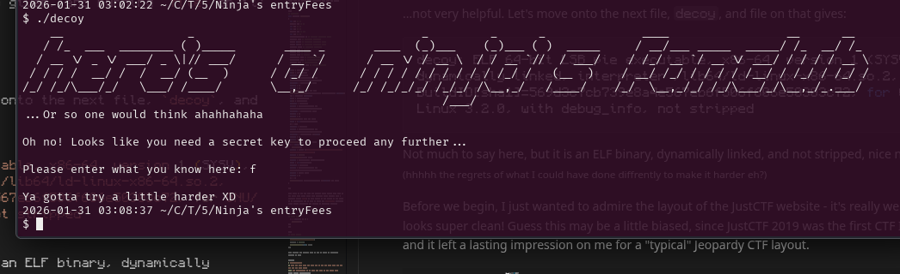
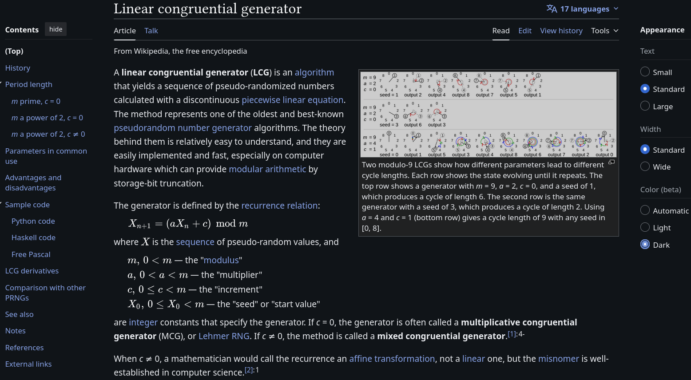
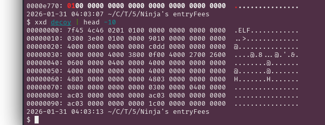
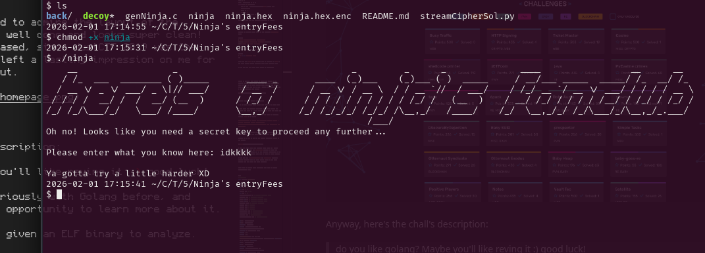
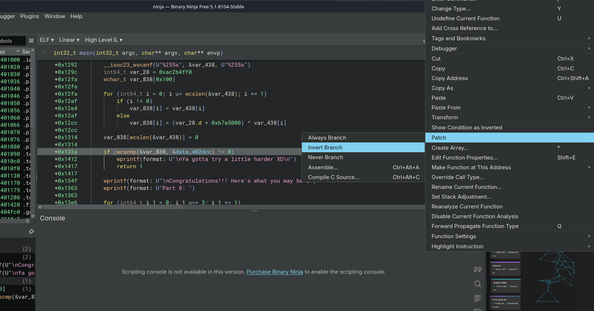

## 500 Member miniCTF Writeup

<div style="display:flex;align-items:center;width:100%">
<div style="flex:1;text-align:left">
<a href="https://pointerpointer.com/">WoawoWOaw</a>
</div>
<div style="flex:1;text-align:center">
<a href="index.html">Home</a>
</div>
<div style="flex:1;text-align:right">
<a href="Seccon142025.html">Seccon 14 (2025)</a></div>
</div>


## Challenge Directory

[Ninja's entryFees](#challenge-name-ninjas-entryfees)

### Challenge Name: `Ninja's entryFees`


A CTF challenge written by moi? yes indeed!! To make it more interesting, I decided to involve both Cryptography and Reverse Engineering in this challenge. (although crypto is the main focus here with rev being an afterthought)

okay so here's the description (with more hints than necessary apparantly based on how the ctf went down :p ):

> Oh look what we have here! Apparantly our good frind Ninja's fans have chipped in to try and make sure the fanclub's entry fees are paid for by everyone that wants to join! How thoughtful of them!

> Unfortunately the reciept generation program seems to have gotten outside of their hands, but luckily it's still encrypted using a stream cipher!

> I tried looking up some information online, and think that this might be helpful? [https://sourceware.org/git/?p=glibc.git;a=blob;f=stdlib/random_r.c;hb=glibc-2.15#l371](https://sourceware.org/git/?p=glibc.git;a=blob;f=stdlib/random_r.c;hb=glibc-2.15#l371)

> Apparantly the random number generator used in GNU C Library's implementation of the C rand() function uses a Linear Congruential Generator (LCG) if the state is initialized with small enough parameters...

> Author: 3dcantaloupe (guavass) 😋

We are also given a handout, and here it is if ya wanna try it out before reading my writeup: [epiX hAND0ut h3r3](THEM500CTF/Ninja's%20entryFees.zip)


In the handout, we have a c file which looks like it generates an encrypted version of the input and the key used to encrypt it.

```c
// genNinja.c
#include <stdlib.h>
#include <stdio.h>
#include <time.h>

//Return a byte at a time of the rand() keystream
char randchar() {
  static int key;
  static int i = 0;
  i = i % 4;
  if (i == 0) key = rand();
  return ((char *)(&key))[i++];
}

int main(int argc, const char* argv[]) {
  static char randstate[64];
  initstate(time(NULL),randstate,31);

  FILE *input, *output;
  input = fopen("ninja.hex", "r");
  output = fopen("ninja.hex.enc", "w");

  FILE *key = fopen("key", "w");

  int c;
  while ((c = fgetc(input)) != EOF){
    char stream = randchar();
    fputc(c^stream,output); //XOR input with keystream byte
    fputc(stream,key);
  }
  fclose(input);
  fclose(output);
  fclose(key);
}
```

The program uses the `initstate` function to initialize the random number generator state with a seed based on the current time. It then reads bytes from an input file (`ninja.hex`), generates a keystream byte using the `randchar` function, and XORs each byte of the input with the keystream byte to produce the encrypted output, which is written to `ninja.hex.enc` (which is given in the handout). The keystream bytes are also then written to a separate file called `key`.


The file `ninja.hex.enc` is also given, and running `file` on it:

```bash
ninja.hex.enc: data
```

...not very helpful. Let's move onto the next file, `decoy`, and file on that gives:

```bash
decoy: ELF 64-bit LSB pie executable, x86-64, version 1 (SYSV),
dynamically linked, interpreter /lib64/ld-linux-x86-64.so.2, 
BuildID[sha1]=569d3c7cb739e8a4e567eb6f506f606e50303c72, for GNU/
Linux 3.2.0, with debug_info, not stripped
```

Not much to say here, but it is an ELF binary, dynamically linked, and not stripped, nice nice nice! <small>(hhhhh the regrets of what I could have done diffrently to make it harder eh?)</small>

Running the binary, we get:


Such epic ascii art wow!! but more importantly, I hope the people realized that this decoy binary was given to aid with decrypting the `ninja.hex.enc` file, since it is almost identical to the real binary (`ninja`) with the exception of a few lines in the middle and the input reqtuired.

OK I think we are ready to look into Linear Congruential Generators (LCGs). Lets start by reading up on them a bit. Wikipedia is a great place to start: [https://en.wikipedia.org/wiki/Linear_congruential_generator](https://en.wikipedia.org/wiki/Linear_congruential_generator)


<small>source: [https://en.wikipedia.org/wiki/Linear_congruential_generator](https://en.wikipedia.org/wiki/Linear_congruential_generator)</small>


From here we get the secret sauce formula for generating the next number from the previous one in a Linear Congruential Generator:

$$
X_{n+1} = (aX_n + c) \mod m
$$

where $m$ is the modulus, $a$ is the multiplier, $c$ is the increment, and $X_n$ is the previous value. Don't worry, too much about the math, we will see how to use this in practice soon enough!

I could have make this challenge a little harder by not handing out the decoy binary. Naturally, this may make you wonder... what's so special about this challenge that I thought a decoy binary would be helpful?

*hmmmmmmmm... **hmmmmmmmmmmmmmmmmmmmm....***

maybe I can use some kind of data/structure to help decrypt `ninja.hex.enc`? actually let's put a pin in that thought for now, and look for the parameters of the LCG used in this binary for now.

Using the link from the chall's description, <small>(again, why did I do this to myself???)</small>, we would need to scroll all the way down to line 375:

```c
// projects / glibc.git / blob  line 375
val = ((state[0] * 1103515245) + 12345) & 0x7fffffff;
```

from which we can deduce that $m = 2147483648$ aka $2^{31}$ (we would be adding 1 since the line does the modulus using a bitmask), $a = 1103515245$, and $c = 12345$.


I love the little comment they left:

```c
// projects / glibc.git / blob  line 349
 /* If we are using the trivial TYPE_0 R.N.G., just do the old linear congruential bit.  
 Otherwise, we do our fancy trinomial stuff, which is the same in all the other cases due to all the global variables that have been set up.  
 The basic operation is to add the number at the rear pointer into the one at the front pointer.  
 Then both pointers are advanced to the next location cyclically in the table. 
 The value returned is the sum generated, reduced to 31 bits by throwing away the "least random" low bit. 
 Note: The code takes advantage of the fact that both the front and rear pointers can't wrap on the same call by not testing the rear pointer if the front one has wrapped.  
 Returns a 31-bit random number.  */
 ```

and the CAPTCHA they have on that page lol


Looking at the first few bits of the raw `decoy` binary, we can assume that the first few bytes are probably the same in the real binary `ninja`. 

```bash
$ xxd decoy | head -10
00000000: 7f45 4c46 0201 0100 0000 0000 0000 0000  .ELF............
00000010: 0300 3e00 0100 0000 9010 0000 0000 0000  ..>.............
00000020: 4000 0000 0000 0000 c0dd 0000 0000 0000  @...............
00000030: 0000 0000 4000 3800 0f00 4000 2700 2600  ....@.8...@.'.&.
00000040: 0600 0000 0400 0000 4000 0000 0000 0000  ........@.......
00000050: 4000 0000 0000 0000 4000 0000 0000 0000  @.......@.......
00000060: 4803 0000 0000 0000 4803 0000 0000 0000  H.......H.......
00000070: 0800 0000 0000 0000 0300 0000 0400 0000  ................
00000080: ac03 0000 0000 0000 ac03 0000 0000 0000  ................
00000090: ac03 0000 0000 0000 1c00 0000 0000 0000  ................
```
<small>here's a screenshot if the bash didn't render properly:</small>



`7f45 4c46 0201` (the first 6 bytes) are the specific bytes I used to generate the state of the LCG to then generate the keystream which I can then use to decrypt `ninja.hex.enc`. In theory, you could use less than that, but I wanted to also check the output of these 6 bytes to make sure they were consistent with what we assumed.

In my exploit script, I made a few helper functions to help with the LCG generation, XORing and decryption:

```python
def bytexor(a, b):     
  # xor two byte arrays (trims the longer input)
    return bytes([x ^ y for (x,y) in zip (a,b)])

def nextOut(Xn, a, c, m):
    return (a * Xn + c) % m

def saveOutput(deciphers):
    outFileName = input("Enter output file name: ")
    with open(outFileName, "w") as f:
        for d in deciphers:
            f.write(d)
```

I first XORed the bytes from the `decoy` binary with the first 6 bytes of the `ninja.hex.enc` file to get the first 6 bytes of the keystream:

```python
cTexPath = sys.argv[1]
cTex = open(cTexPath, 'rb').read()

out1 = bytexor(cTex[:4], "7f45".encode('utf-8'))
out2 = bytexor(cTex[4:8], "4c46".encode('utf-8'))
out3 = bytexor(cTex[8:12], "0201".encode('utf-8'))
```

Then I printed out the keystream bytes as integers:

```python
X1 = struct.unpack('<I', out1)[0]   #little endian
X2 = struct.unpack('<I', out2)[0]
X3 = struct.unpack('<I', out3)[0]

print(f"Observed outputs: {X1}, {X2}, {X3}")
```

We can then save these outputs as the first 3 outputs of the LCG as part of our decrypted plaintext! (these are the same bytes as our assumption, `7f45 4c46 0201`)

```python
pTxt = bytexor(out1, cTex[:4]) + bytexor(out2, cTex[4:8]) + bytexor(out3, cTex[8:12])
```

Now we can set the values of $a$, $c$, and $m$ as constants in our script and use a loop and our `nextOut` function to generate the rest of the keystream outputs, and in turn, decrypt the rest of the `ninja.hex.enc` file:

```python
a = 1103515245 # from line 375 of rand.c
c = 12345 # from line 375 of rand.c
m = 2147483648 # 0x7fffffff + 1

stIdx = 12
edIdx = 16
nOut = nextOut(X3, a, c, m)
while(stIdx < len(cTex)):
    pTxt = pTxt + bytexor(struct.pack('<I', nOut), cTex[stIdx:edIdx])
    stIdx += 4
    edIdx += 4
    nOut = nextOut(nOut, a, c, m)
```

Finally, we can save the decrypted plaintext to a file:

```python
saveOutput(pTxt.decode('utf-8'))
```

running our exploit script gives us the decrypted `ninja.hex` file:

```bash
$ python streamCipherSol.py ninja.hex.enc 
Observed outputs: 1986477114, 757760235, 253931080
Enter output file name: ninja.hex
```

xxd can help us convert the .hex file to a binary:

```bash
$ xxd -r -p ninja.hex ninja
```

Here, the flag `-r` is for reverse (hex to binary), and `-p` is for plain hexdump format (assuming input only contains hex).

We can then run the binary after making it executable:



Here's my full exploit script for reference:

```python
# streamCipherExploit.py
import struct
import sys

cTexPath = sys.argv[1]
cTex = open(cTexPath, 'rb').read()

def saveOutput(deciphers):
    outFileName = input("Enter output file name: ")
    with open(outFileName, "w") as f:
        for d in deciphers:
            f.write(d)

def bytexor(a, b):
  # xor two byte arrays (trims the longer input)
    return bytes([x ^ y for (x,y) in zip (a,b)])

def nextOut(Xn, a, c, m):
    return (a * Xn + c) % m

def main():

    out1 = bytexor(cTex[:4], "7f45".encode('utf-8'))
    out2 = bytexor(cTex[4:8], "4c46".encode('utf-8'))
    out3 = bytexor(cTex[8:12], "0201".encode('utf-8'))

    X1 = struct.unpack('<I', out1)[0]   #little endian
    X2 = struct.unpack('<I', out2)[0]
    X3 = struct.unpack('<I', out3)[0]

    print(f"Observed outputs: {X1}, {X2}, {X3}")

    pTxt = bytexor(out1, cTex[:4]) + bytexor(out2, cTex[4:8]) + bytexor(out3, cTex[8:12])

    a = 1103515245 # from line 375 of rand.c
    c = 12345 # from line 375 of rand.c
    m = 2147483648 # 0x7fffffff + 1??

    stIdx = 12
    edIdx = 16
    nOut = nextOut(X3, a, c, m)
    while(stIdx < len(cTex)):
        pTxt = pTxt + bytexor(struct.pack('<I', nOut), cTex[stIdx:edIdx])
        stIdx += 4
        edIdx += 4
        nOut = nextOut(nOut, a, c, m)
    
    saveOutput(pTxt.decode('utf-8'))

if __name__=='__main__':
    main()
```


Finally!! now all we have left between us and the flag is some rev action!


Opening up the binary in binaryninja we get:

```c
// main function
+0x1208    int32_t main(int32_t argc, char** argv, char** envp)

+0x1208    {
+0x1208        int32_t argc_1 = argc;
+0x122f        int64_t entry_rcx;
+0x122f        uint64_t entry_r8;
+0x122f        ssize_t entry_r9;
+0x122f        setlocale(6, &data_402068, envp, entry_rcx, entry_r8, entry_r9, argv);
+0x1239        int64_t var_20 = 0xd3e4b7fa;
+0x124c        wprintf(U"    __                  _                                 _         ");
+0x1260        wprintf(U"Oh no! Looks like you need a secret key to proceed any further...\n");
+0x1274        wprintf(U"\nPlease enter what you know here: ");
+0x1292        wchar_t var_438[0x102];
+0x1292        __isoc23_wscanf(U"%255s", &var_438, U"%255s");
+0x129c        int64_t var_28 = 0xac2b4ff0;
+0x12fa        wchar_t var_838[0x100];
+0x12fa        
+0x12fa        for (int64_t i = 0; i < wcslen(&var_438); i += 1)
+0x12fa        {
+0x12fa            if (i)
+0x12e4                var_838[i] = var_438[i];
+0x12af            else
+0x12cc                var_838[i] = ((uint32_t)var_28 + 0xb7a5000) ^ var_438[i];
+0x12fa        }
+0x12fa        
+0x1314        var_838[wcslen(&var_438)] = 0;
+0x1314        
+0x133a        if (wcscmp(&var_838, &data_402dcc))
+0x133a        {
+0x1412            wprintf(U"\nYa gotta try a little harder XD\n");
+0x1417            return 1;
+0x133a        }
+0x133a        
+0x134f        wprintf(U"\nCongratulations!!! Here's what you may be l");
+0x1363        wprintf(U"Part 8: ");
+0x1363        
+0x13e6        for (int64_t i_1 = 0; i_1 <= 3; i_1 += 1)
+0x13e6        {
+0x13e6            char var_83c[0x4];
+0x13b0            var_83c[i_1] = (char)(((var_28 + 0xb7a5000) ^ (var_20 - 0xb78))
+0x13b0                >> (char)((uint32_t)i_1 << 3));
+0x13d7            wprintf(&data_402ee4, (uint64_t)var_83c[i_1], &data_402ee4);
+0x13e6        }
+0x13e6        
+0x13f7        wprintf(&data_402060);
+0x13fc        return 0;
+0x1208    }
```

I hope line `+0x13b0` caught all of your eyes!! Since this is what is output as the result of the "Congratulations!!!" message, we would just need to reverse these operations to get the flag!

```c
+0x13b0            var_83c[i_1] = (char)(((var_28 + 0xb7a5000) ^ (var_20 - 0xb78))
+0x13b0                >> (char)((uint32_t)i_1 << 3));
```


Let's make a note of the variables used in that line:

- `var_28` = `0xac2b4ff0` (from line `+0x124c`)
- `var_20` = `0xd3e4b7fa` (from line `+0x122f`)

Here's our reverse equation and operations dereferencing everything:

= `0xac2b4ff0` + `0xb7a5000` ^ (`0xd3e4b7fa` - `0xb78`)
= `0xb7a59ff0` ^ `0xd3e4ac82`
= `64413372`

converting this hex to ascii gives us `dA3r` which when reversed (since our bytes are in little-endian order) gives us the flag, `r3Ad`!!


If you wanna know what the correct input is, we would just need to reverse `0xb7a59ff0` (or `0xac2b4ff0 [which is var_28] + 0xb7a5000`) and we get `0xf09fa5b7`, which is the UTF-8 encoding of "🥷" !! <small>source: https://www.compart.com/en/unicode/U+1F977</small>

```bash
$ ./ninja
    # my epix ascii art skipped for brevity #
Oh no! Looks like you need a secret key to proceed any further...

Please enter what you know here: 🥷

Congratulations!!! Here's what you may be looking for...
Part 8: r3Ad
```

Here's where I made yet another *gigantic* mistake in my challenge design... well I think it's just easier if I just show it to ya



eeeyep, now that line checks if the input is NOT equal to the hardcoded string, when it should be checking for equality XD

```c
+0x133a  if (wcscmp(&var_838, &data_402dcc) == 0)
```

Success!! we can then save the binary, add the execution bit, and run the patched binary to get the flag!!

```bash
$ ./ninjaPatched
    # my epix ascii art skipped again for brevity ;( #
Oh no! Looks like you need a secret key to proceed any further...

Please enter what you know here: idk bro, just gime the flag prety plessss

Congratulations!!! Here's what you may be looking for...
Part 8: r3Ad
```

<small>To cite the sources, I was made aware of this glaring issue from these messages on discord:</small>

<small>Them: "Yeah u can get the part using that or patch the file .bin cz it will never give u the answer so patching it and enter anything will give u answer"</small>

<small>me: "Well the flag isn't in the decoy bin tho? Unless I'm misinterpreting what you are saying?"</small>

<small>Them: "Yes it is not in it decoy but you can get it from .enc file when u tansfer to .hex than to .bin this can be patched decoy isn’t the true one"</small>

<small>tysm for pointing that out mysterious discord user!!</small>


Oh here's my source files for both ninja and decoy binaries if ya wanna check em out:
- [ninja.c](THEM500CTF/ninja.c)
- [decoy.c](THEM500CTF/decoy.c)


And that's about it for now. Learned a lot for the next time I design a challenge!! I hope you learned something too :)

### Flag: `Part 8: r3Ad`


<div style="display:flex;align-items:center;width:100%">
<div style="flex:1;text-align:left">
<a href="https://pointerpointer.com/">WoawoWOaw</a>
</div>
<div style="flex:1;text-align:center">
<a href="index.html">Home</a> /
<a href="THEM500CTF.html#">Top</a>
</div>
<div style="flex:1;text-align:right">
<a href="Seccon142025.html">Seccon 14 (2025)</a></div>
</div>
